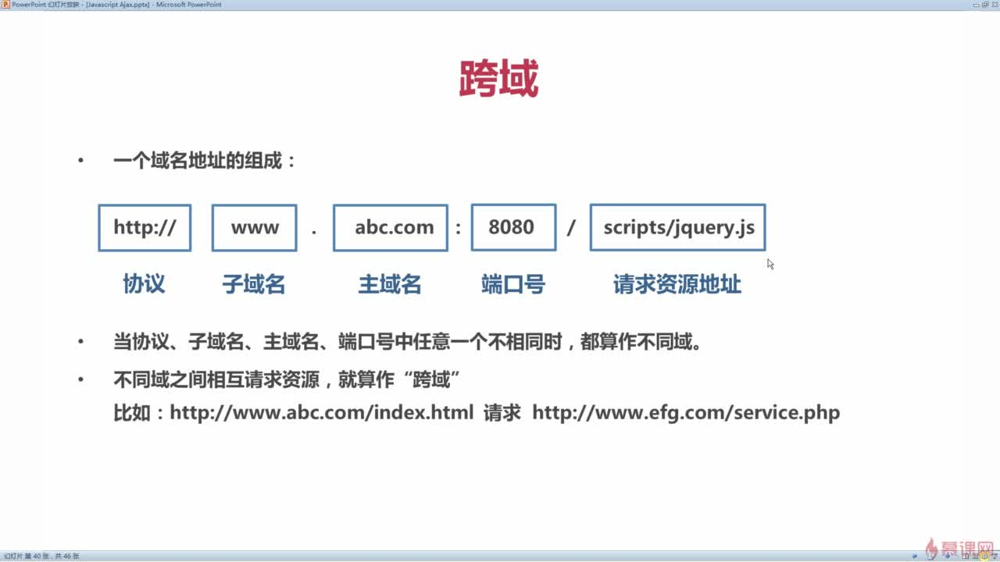

# AJAX

> AJAX：Asynchronous JavaScript and XML （异步的 JavaScript 和 XML）
> Ajax 不是某种编程语言，是一种在无需重新加载整个网页的情况下能够更新部分网页的技术。

#### XMLHttpRequest

> 通过这个对象可以使后台和服务器之间交换数据，而且数据的交换不用重新加载整个页面。有了 XMLHttpRequest 这个对象才能实现异步请求和局部刷新

创建 XHR 对象:

```
  var request;
  if(window.XMLHttpRequest){
  request = new XMLHttpRequest();
  }else{
  request = new ActiveXObject("Microsoft.XMLHTTP");//IE5、6
  }
```

XMLHttpRequest 发送 http 请求例子：

```
  var request = new XMLHttpRequest();
  request.open("GET", "server.php?number=" + document.getElementById("keyword").value);
  request.send();
  request.onreadystatechange = function() {
  if (request.readyState===4) {
  	if (request.status===200) {
  		document.getElementById("searchResult").innerHTML = request.responseText;
  	} else {
  		alert("发生错误：" + request.status);
  	}
  }
  }
```

```
var request = new XMLHttpRequest();
request.open("POST", "server.php");
var data = "name=" + document.getElementById("staffName").value + "&number=" +   document.getElementById("staffNumber").value + "&sex=" +   document.getElementById("staffSex").value + "&job=" + document.getElementById  ("staffJob").value;
request.setRequestHeader("Content-type","application/x-www-form-urlencoded");
request.send(data);
request.onreadystatechange = function() {
if (request.readyState===4) {
if (request.status===200) {
document.getElementById("createResult").innerHTML = request.responseText;
} else {
alert("发生错误：" + request.status);
}
}
```

#### jQuery 实现 ajax:


`settings对象`：

- `contentType` (default: 'application/x-www-form-urlencoded; charset=UTF-8').

  发送 json 数据改为`application/json;charset=utf-8`。 `data`为 json 字符串。

- `xhrFields: { withCredentials: true }` 跨域请求带上 被调用方法的`cookie`

#### axios 发送 ajax 请求

> `axios`(基于 `promise` )是用于`浏览器`和 `node.js` 的 `http 客户端`,要使用 axios 需要通过 `npm/Yarn` 或一个 `CDN` 链接安装 `axios`。

axios 特点:

- 支持浏览器和 node.js
- 支持 promise
- 能拦截请求和响应
- 能转换请求和响应数据
- 能取消请求
- 自动转换 JSON 数据
- 浏览器端支持防止 CSRF(跨站请求伪造)

#### AJAX 跨域



AJAX 跨域的原因就是:

1. 浏览器限制

2. 跨域

3. `XMLHttpRequest`

   利用`<script src=""></script>` 发送一个类型为 script 的请求不受跨域限制。

跨域处理方式：

1. `代理`

   > 属于调用方的处理

   让相同域名下的后端服务器去访问(或者是通过代理服务器如 nginx 转发 http 请求)， 实现隐藏跨域。

2. `JSONP`

   只能处理 GET 请求,**被调用方服务端**后台代码需要做相应的处理。

   实现原理 利用`<script src="url(该地址的响应是js)"></script>`发送请求,返回的 js 代码调用定义好的函数

   ```
    //index.html
    <script>
    function fun(response) {
      console.log(response.name + ':' + response.age);
    }
    </script>
    <script src="http://localhost:8080/fun"></script>

    // http://localhost:8080/fun
    返回：
    fun({"name":"James",
          "age":32
        })
   ```

   `$.ajax({dataType:"JSONP",jsonp:"callback", success:function(){}})`

   请求会带上一个`callback`参数，后端返回 javascript 代码=>`callback 函数({响应数据})`;

   **SpringMVC 处理 jsonp**:

   ```
     import org.springframework.web.bind.annotation.ControllerAdvice;
     import org.springframework.web.servlet.mvc.method.annotation.AbstractJsonpResponseBodyAdvice;
     @ControllerAdvice
     public class JsonpAdvice extends AbstractJsonpResponseBodyAdvice {

         public JsonpAdvice() {
             // 请求参数是callback
             super("callback");
         }
     }
   ```

3. XHR2

   > 属于被调用方的处理

   **被调用方服务端**添加一些响应头字段，支持跨域请求。`nginx`添加一些响应头字段 也能实现同样的功能。

   发生跨域时 `Request Headers` 请求头带上 `Origin` 字段，值为调用方法的域名。

   带 cookie 的跨域`Response Headers`响应头的`Access-Control-Allow-Origin`字段要和 `Origin`一样。

   `filter` 过滤器实现:

   > _`Spring`框架直接在类或者方法添加注解`@CrossOrigin`支持跨域_

   ```
   import org.springframework.stereotype.Component;
   import org.springframework.util.StringUtils;

   import javax.servlet.*;
   import javax.servlet.annotation.WebFilter;
   import javax.servlet.http.HttpServletRequest;
   import javax.servlet.http.HttpServletResponse;
   import java.io.IOException;

       @Component
       @WebFilter(urlPatterns="/\*",filterName="crosFilter")
       public class CrosFilter implements Filter{
       @Override
       public void init(FilterConfig filterConfig) throws ServletException {

              }

       @Override
       public void doFilter(ServletRequest request, ServletResponse response,        FilterChain chain) throws IOException, ServletException {
           HttpServletRequest httpServletRequest   = (HttpServletRequest)request;
           HttpServletResponse httpServletResponse = (HttpServletResponse)       response;

           // 发生跨域时请求头带上 Origin
           String origin = httpServletRequest.getHeader("Origin");
           if(!StringUtils.isEmpty(origin)) {
               httpServletResponse.addHeader("Access-Control-Allow-Origin",        origin);
           }

           //  自定请求头
           String header =  httpServletRequest.getHeader       ("Access-Control-Request-Headers");
           if(!StringUtils.isEmpty(header)) {
               httpServletResponse.addHeader("Access-Control-Allow-Headers",        header);
           }
           httpServletResponse.addHeader("Access-Control-Allow-Methods", "*");
           // 带跨域cookie
           //Access-Control-Allow-Origin 要全部匹配
           httpServletResponse.addHeader("Access-Control-Allow-Credentials",        "true");
           chain.doFilter(httpServletRequest, httpServletResponse);

         }

       @Override
       public void destroy() {

         }
     }

   ```
