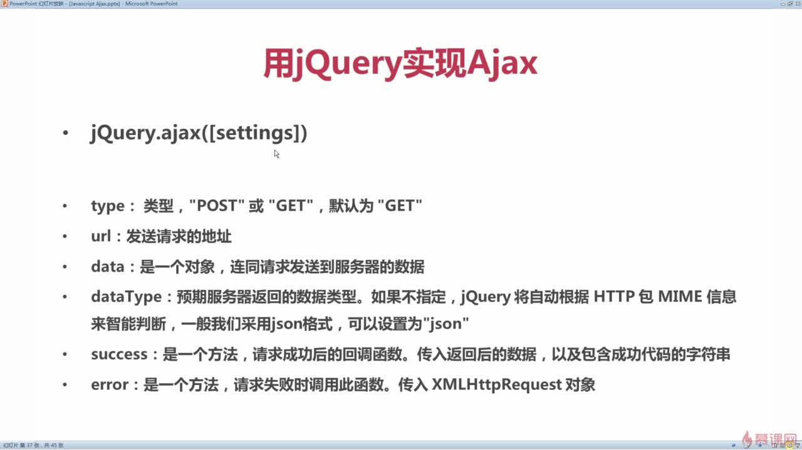

# jQuery

#### AJAX

> AJAX：Asynchronous JavaScript and XML （异步的 JavaScript 和 XML）
> Ajax 不是某种编程语言，是一种在无需重新加载整个网页的情况下能够更新部分网页的技术。

`XMLHttpRequest:`

通过这个对象可以使后台和服务器之间交换数据，而且数据的交换不用重新加载整个页面。有了 XMLHttpRequest 这个对象才能实现异步请求和局部刷新

创建 XHR 对象:

```
  var request;
  if(window.XMLHttpRequest){
  request = new MXLHttpRequest();
  }else{
  request = new ActiveXObject("Microsoft.XMLHTTP");//IE5、6
  }
```

**http**

> HTTP(HyperText Transfer Protocol)是一套计算机通过网络进行通信的规则。计算机专家设计出 HTTP，使 HTTP 客户（如 Web 浏览器）能够从 HTTP 服务器(Web 服务器)请求信息和服务，HTTP 目前协议的版本是 1.1.HTTP 是一种无状态的协议，无状态是指 Web 浏览器和 Web 服务器之间不需要建立持久的连接，这意味着当一个客户端向服务器端发出请求，然后 Web 服务器返回响应(response)，连接就被关闭了，在服务器端不保留连接的有关信息.HTTP 遵循请求(Request)/应答(Response)模型。Web 浏览器向 Web 服务器发送请求，Web 服务器处理请求并返回适当的应答。所有 HTTP 连接都被构造成一套请求和应答。

一个完整的 HTTP 请求过程：

- 建立 TCP 连接
- Web 浏览器向 Web 服务器发送请求命令
- Web 浏览器发送请求头信息
- Web 服务器应答
- Web 服务器发送应答头信息
- Web 服务器发数据
- Web 服务器关闭 TCP 连接

一个 HTTP 请求(Request)一般由四部分组成：

- HTTP 请求的方法或动作，比如是 `GET、POST、PUT、DELETE` 请求
- 正在请求的 URL，总得知道请求的地址是什么吧
- 请求头，包含一些客户端环境信息，身份验证信息等
- 请求体，也就是请求正文，请求正文中可以包含客户提交的查询字符串信息，表单信息等等
  请求头和请求体中间有空格（很重要）

一般 HTTP 响应(Response)由 3 部分组成：

- 一个数字或文字组成的状态码，用来显示请求是成功还是失败
- 响应头，和请求头一样包含许多有用信息，如服务器类型、日期时间、内容类型和长度等
- 响应体，即响应正文

响应 Response 状态码:

- 1xx：信息类，web 瀏覽器請求，正在进一步的处理中；
- 2xx：成功，表示用户请求被正确接受，理解和处理 200 ok
- 3xx:重定向，表示请求没有成功，客户必须采取进一步的动作
- 4xx:客户端错误，表单提交的路径有错误，例如 404 not found，以为这请求中所引用的文档不存在
- 5xx:服务器错误，表示服务器不能完成对请求的处理 ： 如 500

XMLHttpRequest 发送 http 请求例子：

```
  var request = new XMLHttpRequest();
  request.open("GET", "server.php?number=" + document.getElementById("keyword").value);
  request.send();
  request.onreadystatechange = function() {
  if (request.readyState===4) {
  	if (request.status===200) {
  		document.getElementById("searchResult").innerHTML = request.responseText;
  	} else {
  		alert("发生错误：" + request.status);
  	}
  }
  }
```

```
var request = new XMLHttpRequest();
request.open("POST", "server.php");
var data = "name=" + document.getElementById("staffName").value + "&number=" +   document.getElementById("staffNumber").value + "&sex=" +   document.getElementById("staffSex").value + "&job=" + document.getElementById  ("staffJob").value;
request.setRequestHeader("Content-type","application/x-www-form-urlencoded");
request.send(data);
request.onreadystatechange = function() {
if (request.readyState===4) {
if (request.status===200) {
document.getElementById("createResult").innerHTML = request.responseText;
} else {
alert("发生错误：" + request.status);
}
}
```

Jquery 实现 ajax:



`settings对象`：

- `contentType` (default: 'application/x-www-form-urlencoded; charset=UTF-8').

  发送 json 数据改为`application/json;charset=utf-8`. `data`为 json 字符串。

- `xhrFields: { withCredentials: true }` 跨域请求带上 `cookie`

#### 跨域


AJAX 跨域的原因就是:

1. 浏览器限制

2. 跨域

3. `XMLHttpRequest`

   利用`<script src=""></script>` 发送一个类型为 script 的请求不受跨域限制。

跨域处理方式：

1. `代理`

   让相同域名下的后端服务器去访问， 实现隐藏跨域。

2. `JSONP`

   只能处理 GET 请求,后台代理需要做相应的处理。

   实现原理 利用`<script src="url(该地址的响应是js)"></script>`发送请求,返回的 js 代码调用定义好的函数

   ```
    //index.html
    <script>
    function fun(response) {
      console.log(response.name + ':' + response.age);
    }
    </script>
    <script src="http://localhost:8080/fun"></script>

    // http://localhost:8080/fun
    返回：
    fun({"name":"James",
          "age":32
        })
   ```

   `$.ajax({dataType:"JSONP",jsonp:"callback", success:function(){}})`

   请求会带上一个`callback`参数，后端返回 javascript 代码=>`callback 函数({响应数据})`;

   SpringMVC 处理 jsonp:

   ```
     import org.springframework.web.bind.annotation.ControllerAdvice;
     import     org.springframework.web.servlet.mvc.method.annotation.AbstractJsonpResponseBodyAdvice;
     @ControllerAdvice
     public class JsonpAdvice extends AbstractJsonpResponseBodyAdvice {

         public JsonpAdvice() {
             // 请求参数是callback
             super("callback");
         }
     }
   ```

3. XHR2

   > 发生跨域时 `Request Headers` 请求头带上 `Origin` 字段

   **被调用方服务端**添加一些响应头字段，支持跨域请求。

   `nginx`添加一些响应头字段 也能实现同样的功能。

   `Spring`框架直接在类或者方法添加注解`@CrossOrigin`支持跨域

   `filter` 过滤器实现:

```
import org.springframework.stereotype.Component;
import org.springframework.util.StringUtils;

import javax.servlet.*;
import javax.servlet.annotation.WebFilter;
import javax.servlet.http.HttpServletRequest;
import javax.servlet.http.HttpServletResponse;
import java.io.IOException;

    @Component
    @WebFilter(urlPatterns="/\*",filterName="crosFilter")
    public class CrosFilter implements Filter{
    @Override
    public void init(FilterConfig filterConfig) throws ServletException {

           }

    @Override
    public void doFilter(ServletRequest request, ServletResponse response,     FilterChain chain) throws IOException, ServletException {
        HttpServletRequest httpServletRequest   = (HttpServletRequest)request;
        HttpServletResponse httpServletResponse = (HttpServletResponse)    response;

        // 发生跨域时请求头带上 Origin
        String origin = httpServletRequest.getHeader("Origin");
        if(!StringUtils.isEmpty(origin)) {
            httpServletResponse.addHeader("Access-Control-Allow-Origin",     origin);
        }

        //  自定请求头
        String header =  httpServletRequest.getHeader    ("Access-Control-Request-Headers");
        if(!StringUtils.isEmpty(header)) {
            httpServletResponse.addHeader("Access-Control-Allow-Headers",     header);
        }
        httpServletResponse.addHeader("Access-Control-Allow-Methods", "*");
        // 带跨域cookie
        //Access-Control-Allow-Origin 要全部匹配
        httpServletResponse.addHeader("Access-Control-Allow-Credentials",     "true");
        chain.doFilter(httpServletRequest, httpServletResponse);

      }

    @Override
    public void destroy() {

      }
  }

```

#### jQuery Validation Plugin

jQuery Validation Plugin 是表单验证插件。

该插件自带包含必填、数字、URL 在内容的验证规则，即时显示异常信息，此外，还允许自定义验证规则。

引入：

`<script src="jquery.validate-1.13.1.js"></script>`

核心方法：

validate 定义了基本的校验规则和一些有用的配置项。

调用方法如下：

```
$(form).validate({options})
```

其中 form 参数表示表单元素，options 参数表示调用方法时的配置对象，所有的验证规则和异常信息显示的位置都在该对象中进行设置。

options：

- debug(default: false)：如果这个参数为 true,那么表单不会提交，只进行检查
- rule:验证规则,指元素和验证方法的关联。

```

{

要验证的字段名:{
验证方法:xxxxx,
验证方法:xxxxx

}
...
}

```

- messages：提示信息

```

{

要验证的字段名:{
验证方法:提示信息,
验证方法:提示信息
}
...
}

```

基本验证方法:


示例代码：

```

<script>

        $(document).ready(function () {
            $("#demoForm").validate({
                // debug: true 不会提交
                debug: false,
                rules: {
                    // 对应与字段的name属性
                    username: {
                        required: true,
                        minlength: 2,
                        maxlength: 10,
                        //远程检验
                        remote: {
                            url: 'remote.json',
                            type: 'POST',
                            data: {
                                loginTime: + new Date()
                            }
                        }
                    },
                    password: {
                        required: true,
                        minlength: 2,
                        maxlength: 16
                    },
                    "confirm-password": {
                        equalTo: "#password"
                    },
                    email: {
                        required: true,
                        email: true
                    }
                },
                messages: {
                    username: {
                        required: '请输入用户名',
                        minlength: '用户名不能小于2个字符',
                        maxlength: '用户名不能超过10个字符',
                        remote: '用户名不存在'
                    },
                    password: {
                        required: '请输入密码',
                        minlength: '密码不能小于2个字符',
                        maxlength: '密码不能超过16个字符'
                    },
                    "confirm-password": {
                        equalTo: "两次输入密码不一致"
                    },
                    email: {
                        required: "请输入邮箱",
                        email: '请输入邮箱'
                    }

                },

                highlight: function (element, errorClass, validClass) {
                    $(element).addClass(errorClass).removeClass(validClass);
                    $(element).fadeOut().fadeIn();
                },
                unhighlight: function (element, errorClass, validClass) {
                    $(element).removeClass(errorClass).addClass(validClass);
                },
                submitHandler: function (form) {
                    console.log($(form).serialize())
                }
            });

            $("#check").click(function () {
                // 校验是否通过
                alert($("#demoForm").valid() ? "填写正确" : "填写不正确");
            });
        });
    </script>

```
