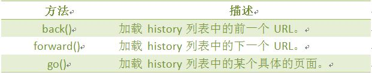

# JavaScript 入门篇

#### HTML 如何插入 JS

- 使用`<script type="text/javascript"></script>`标签在 HTML 网页中插入 JavaScript 代码
- 引用 JS 外部文件 `<script src="script.js"></script>`

JS 在页面中的位置:

- 放在`<head>`部分:

  最常用的方式是在页面中 head 部分放置`<script>`元素，浏览器解析 head 部分就会执行这个代码，然后才解析页面的其余部分。

- 放在`<body>`部分:

  JavaScript 代码在网页读取到该语句的时候就会执行。

> javascript 作为一种脚本语言可以放在 html 页面中任何位置，但是浏览器解释 html 时是按先后顺序的，所以前面的 script 就先被执行。比如进行页面显示初始化的 js 必须放在 head 里面，因为初始化都要求提前进行（如给页面 body 设置 css 等）；而如果是通过事件调用执行的 function 那么对位置没什么要求的。

#### 如何用 JavaScript 去操作 HTML 元素和 CSS 样式

认识 DOM:

> 文档对象模型 DOM（Document Object Model）定义访问和处理 HTML 文档的标准方法。DOM 将 HTML 文档呈现为带有`元素`、`属性`和`文本`的树结构（节点树）。

将 HTML 代码分解为 DOM 节点层次图:


HTML 文档可以说由节点构成的集合，三种常见的 DOM 节点:

1. `元素节点`：上图中`<html>、<body>、<p>`等都是元素节点，即标签。

2. `文本节点`:向用户展示的内容，如`<li>...</li>`中的 JavaScript、DOM、CSS 等`文本`。

3. `属性节点`:元素属性，如`<a>`标签的链接属性`href`="http://www.imooc.com"

`通过 ID 获取 DOM 元素`:

> 学过 HTML/CSS 样式，都知道，网页由标签将信息组织起来，而标签的 id 属性值是唯一的，就 像是每人有一个身份证号一样，只要通过身份证号就可以找到相对应的人。那么在网页中，我们通 过 id 先找到标签，然后进行操作。

语法:

```
document.getElementById(“id”)
```

`DOM 的 innerHTML 属性`:

> innerHTML 属性用于获取或替换 HTML 元素的内容。

语法:

```
object.innerHTML
```

`改变 HTML 样式`:

> HTML DOM 允许 JavaScript 改变 HTML 元素的样式。如何改变 HTML 元素的样式呢？

语法:

```
object.style.property=new style;
```

`显示和隐藏(display 属性)`:

> 网页中经常会看到显示和隐藏的效果，可通过 display 属性来设置。none:隐藏;block：显示为块级元素即显示。

语法：

```
object.style.display = value
```

`控制 DOM 的类名(className 属性)`:

> className 属性设置或返回元素的 class 属性。为网页内的某个元素指定一个 css 样式来更改该元素的外观

语法：

```
object.className = classname
```

#### Javascript 事件绑定

什么是事件:

> JavaScript 创建动态页面。事件是可以被 JavaScript 侦测到的行为。 网页中的每个元素都可 以产生某些可以触发 JavaScript 函数或程序的事件。比如说，当用户单击按钮或者提交表单数据时，就发生一个鼠标单击（onclick）事件，需要浏览 器做出处理，返回给用户一个结果。

`主要事件表`:


`事件流`:

> 事件流描述的是从页面中接受事件的顺序。

1. 事件冒泡
   事件冒泡，即事件最开始由最具体的元素(文档中嵌套层次最深的那个节点)接收，然后逐级向 上转 播至最不具体的节点(文档)。

2. 事件捕获
   事件捕获的思想是不太具体的节点应该更早接收到事件，而最具体的节点最后接收到事件。

`事件处理程序`:

1. HTML 事件处理程序(直接写在 html 上)

2. DOM0 级事件处理程序(通过 js 绑定到 dom 属性)

3. DOM2 级事件处理程序

   DOM2 级事件定义了两个方法：用于处理指定和删除事件处理程序的操作：addEventListener ()和 removeEventListener()。它们都接收三个参数：要处理的事件名、作为事件处理程序 的函数和一个布尔值。

4. IE 事件处理程序

   attachEvent()添加事件
   detachEvent()删除事件
   这两个方法接收相同的两个参数：事件处理程序名称与事件处理函数

`事件对象`:

> 事件对象 event：

1. type:获取事件类型
2. target：事件目标
3. stopPropagation() 阻止事件冒泡
4. preventDefault() 阻止事件的默认行为(如 a 标签跳转)

#### 浏览器(window)对象

> window 对象是 BOM 的核心，window 对象指当前的浏览器窗口。

`window 对象方法`:


`JavaScript 计时器`:

> 在 JavaScript 中，我们可以在设定的时间间隔之后来执行代码，而不是在函数被调用后立即执行。

`计时器类型`：

1. 一次性计时器：仅在指定的延迟时间之后触发一次。

2. 间隔性触发计时器：每隔一定的时间间隔就触发一次。

`计时器方法`：


`History 对象`:

> history 对象记录了用户曾经浏览过的页面(URL)，并可以实现浏览器前进与后退相似导航的功 能。
> 语法：

```
window.history.[属性|方法]
```

History 对象方法:



`location 对象`:

> location 用于获取或设置窗体的 URL，并且可以用于解析 URL。

`location 对象属性`：


location 对象方法:


`screen 对象`:

> screen 对象用于获取用户的屏幕信息。


`Navigator 对象`:

> Navigator 对象包含有关浏览器的信息，通常用于检测浏览器与操作系统的版本。


