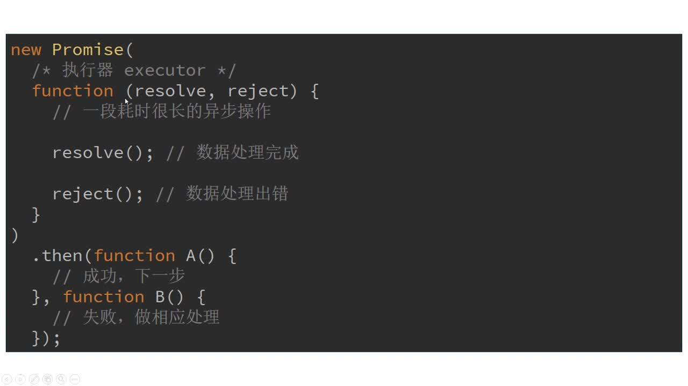

# JavaScript 基础知识

#### JavaScript 语法基础

变量定义:

- `let` 定义普通变量（推荐）。
- `const` 定义常量，后面只能读不能写。
- `var` 定义普通变量，不建议使用。

由于 JavaScript 是弱类型语言，因此你不需要声明变量的数据类型。

```
let x = 20;
```

数据类型

基础类型包括：

- `Undefined`
- `Null`
- `Boolean`
- `Number`
- `String`
- 引用类型包括：`Object`、`Array`、`Function`。

`undefined`

声明一个变量没有赋值，直接访问当前变量可以得到 undefined。

```
let x;
console.log(x); // -> undefined
```

访问一个对象上不存在的 key 也会取到 undefined。

```
let a = {};
console.log(a.b); // -> undefined
```

`null` 表示空值。它不同于 `undefined`，它是有值的只不过是一个空值，而 undefined 是未定义的临时兜底的缺省值。

`Array`

数组类型，栈结构，有序数组。每个 item 可以是任意类型的值.

```
// 字符串数组
['string', 'aaa']

// 对象和字符串混合数组
[{
  aa: 'aaa',
  bb: 'bbb',
}, 'string']

// 函数数组
[() => {
  return '这是一个函数'
}, () => {
  return '这是一个函数'
}]
```

`Array`简易循环举例：

```
let list = [];
list.push('aa');
list.push('bb');

for(let i=0; i<list.length; i++) {
  console.log(list[i]);
}

list.forEach((val, i) => {
  console.log(val, i);
});
```

`object对象类型`

对象类型，无序，需要指定 key 等信息关联值，类似 Java 的 HashMap，比如：

```
// 字面量创建对象
let obj = {
  name: 'string 字符串',
  home: {
    province: '山东'
  }
};

obj.age = 18;

console.log(obj.home.province);
let key = 'age';
console.log(obj[key], obj['age']);
delete obj.name;

// 通过构造器创建对象
function foo(){

}
foo.prototype= {
  say:function(){
    console.log("hello world");
  },
  z:3
}
// obj2对象的原型会指向构造器foo的prototype属性
let obj2 = new foo();
obj2.x=1;
obj2.y=2;
obj2.x;//1
obj2.y;//2
obj2.z;//3
'z' in obj2;//true
obj2.hasOwnProperty('z');//false

obj2.say();


```

`function`

函数类型，用来创建一个函数，通常会返回一个数据。

```
function fun(a, b) {
  return a + b;
}
fun(1, 2); // -> 3;
```

函数是一个可执行的小程序，根据参数处理一些逻辑并返回一段新的数据，在 JavaScript 中用非常多，为此 ES6（新版 JavaScript 语言规范）新增了箭头函数语法，用来简化函数书写：

```
let add = function(a, b) {
  return a + b;
};

等同于

let add = (a, b) => {
  return a + b;
};


```

`类型转换`

类型转换可以通过调用类型的类进行转换，比如将变量 a 转换成 Number 类型，可以使用：

```
let a = '10';
a = Number(a);
```

`转换 number 类型`

JavaScript:

```
let a = '12.33';
console.log(parseInt(a)); // -> 12 number
console.log(parseFloat(a)); // -> 12.33 number
```

`转换 string 类型`

同 Java 每个类型的值都含有 `toString()` 方法。

```
let a = 12.33;
console.log(a.toString()); // -> '12.33'

将 Object 转成 JSON 字符串

let obj = {
  a: 'aa',
  b: 'bb'
};
console.log(JSON.stringify(obj)); // -> '{"a":"aa","b":"bb"}'
let objStr = '{"a":"aa","b":"bb"}';

将 JSON转成 Object

console.log(JSON.parse(objStr)); // -> {a:"aa", b:"bb"}
```

`转换 boolean 类型`

JavaScript 中的 boolean 的值比较多，空字符串、数字 0、null、undefined 均为布尔值的 false。此外 ! 表示取当前布尔值的反值，可以通过 !! 巧妙的将值转换成布尔值类型的数据。

```
console.log(!!'a'); // -> true
console.log(!!''); // -> false 空字符串
console.log(!!0); // -> false 数字 0
console.log(!!10); // -> true
console.log(!!null); // -> false
console.log(!!undefined); // -> false
console.log(!![].length); // -> false
```

`流程控制、比较、运算符等`

`== 和 === 的区别:`

JS 是弱类型语言，=== 表示全等判断，会把类型也进行比较：

```
2 == '2' // -> true
2 === '2' // -> false
```

`+ 运算符会改变数据类型`

运算符会导致数据类型的改变，这是因为运算符同时表示多种含义导致。+ 运算符既可以链接字符串，也可以计算数字，使用时需要注意：

```
2 + 2 // -> 4 number
2 + '2' // -> '22' string
```

#### JavaScript 正则表达式 RegExp

- javascript 通过内置对象 RegExp 支持正则表达式。
- 实例化方法
  - 构造函数
    - ```
       var reg = new RegExp('\\bis\\b','g');
      ```
  - 字面量
    - ```
       <!-- /g 表示全局匹配 -->
       <!-- /i 忽略大小写 -->
       <!-- /m 表示多行搜索 -->
       <!--  \b 表示单词间隔 -->
       <!-- \d 表示数字 -->
       <!-- .表示 [^\r\n] 除了回车和换行的所有字符 -->
       var reg = /\bis\b/g;
      ```
- []构造一个类
  - ```
      <!-- - 表示范围 -->
      /[a-zA-Z]/
      <!-- 所有字母替换成X -->
      "a1b2c3d4f5g6".replace(/[a-g]/g,"X");
      <!-- ^ 取反 -->
      "a1b2c3d4f5g6".replace(/[^a-g]/g,"X")；
    ```
- 边界字符
  - ^ 开始 \$ 结束
    - ```
       "@1a@2a@3a".replace(/^@./g,"X");
       "@1a@2a@3a@".replace(/.@$/g,"X");
      ```
- 量词 {n} 匹配 n 个相同的字符
  - ```
       <!-- {1,} 至少出现一次 -->
      /\d{3}/.test(123);
      <!-- 贪婪模式 匹配6次 -->
      "12345678".replace(/\d{3,6}/,"X");
      <!-- 非贪婪模式 匹配3次 -->
      "12345678".replace(/\d{3,6}?/,"X");
    ```
- () 分组
  ```
    "@1a@2a@3a@".replace(/(@\d.){2}/g,"X");
    <!--  反向引用 -->
    "2015-02-14".replace(/^(\d{4})-(\d{2})-(\d{2})$/g,"$2/$3/$1");
    '15977391234'.replace(/(\d{3})(\d{4})(\d{4})/,'$1****$3');
  ```

#### Promise 语法



示例

```

```
