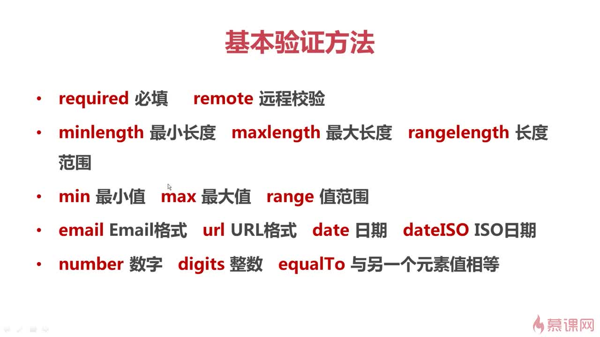

# jQuery

#### 引入

```
<script src="https://cdn.bootcss.com/jquery/3.3.1/jquery.min.js"></script>
```

> window.\$===window.jQuery

#### 等待 DOM 加载完成

- window.onload=function(){}
- \$(function(){});
- \$(document).ready(function(){});

#### jQuery 拓展实例方法

`例子:`

> \$.fn.extend

```
(function($) {
  var hello = function(str) {
    console.log('hello ' + str);
  };
  $.fn.extend({
    hello: function() {
      // 调用hello函数的是一个jQuery对象(this)，
      // 类选择器调用则通过 this.each(function(){}) 遍历
      new hello(this.text());
      return this;
    }
  });
})(jQuery); //设置匿名函数的私有作用域，防止污染

// 调用
<script>
      $(function() {
        $('#test').hello();
      });
</script>
```

#### functions

`add()`

```
//把p元素加到li合集中
$('li').add('p').css('background', 'red')
```

`append()`

```
//.append(), 选择表达式在函数的前面，
//参数是将要插入的内容。
$(".content").append('<div class="append">通过append方法添加的元素</div>')

//.appendTo()刚好相反，内容在方法前面，
//无论是一个选择器表达式 或创建作为标记上的标记
//它都将被插入到目标容器的末尾。
$('<div class="appendTo">通过appendTo方法添加的元素</div>').appendTo($(".content"))

```

`attr()`

```
<!-- 获得结点属性 -->
$("#div1").attr("title")
```

`children()`

```
// 返回匹配元素集合中每个元素的所有子元素
$(".div").children().css('border', '1px solid red')

//找到所有class=div的元素
//找到其对应的子元素ul，然后筛选出最后一个，给边宽加上颜色
$('.div').children(':last').css('border', '3px solid blue')
```

`class操作`

```
$(function () {
    $("#p1").click(function () {
        if ($(this).hasClass("p1")) {
           $(this).removeClass("p1");
        } else {
            $(this).addClass("p1");

    });
    $("#p2").click(function(){
        // 如果存在（不存在）就删除（添加）一个类
        $(this).toggleClass('p1');
    });
});

```

`css()`

> js 写法 domObj.style.keyname=value

```
$("#p1").click(function () {
    $(this).css({
        color: 'red'
    })
});

```

`data()`

```
<p id="p1" data-pid="10001">data-pid="10001"</p>
<script type="text/javascript">
    $(function () {
       $("#p1").click(function(){
           alert($(this).data("pid"));
       });
    });
</script>

```

`each()`

> 包含静态方法和实例方法

```
<div class="d" title="d1"></div>
  <div class="d" title="d2"></div>
  <div class="d" title="d3"></div>
  <div class="d" title="d4"></div>
  <div class="d" title="d5"></div>
  <script type="text/javascript">
      $(function () {
          $(".d").each(function (index, elem) {
              //elem --dom obj
              //each回调方法中的this指向当前迭代的dom元素
              console.log(elem.getAttribute('title'));
          });

         var list = [1, 2, 3, 4];
         $.each(list, function(index, item) {
           console.log('index: ' + index + '  item: ' + item);
         });
      });
  </script>
```

`empty()`

```
//通过empty移除了当前div元素下的所有p元素
//但是本身id=test的div元素没有被删除
$("#test").empty()
```

`extend()`

> 对象合并

```
$(function () {
    var obj = {
        name: 'james',
        age: 32
    };
    $.extend(obj, {
        team: 'CLE',
        age: 33
    });
    console.log(obj);
});

```

`find()`

```
var $spans = $('span');
$("p").find($spans).css('color', 'red');
```

`get()`

```
var $divs = $('div');
// to dom
var dom1 = $divs.get(0);
dom1.style.color = 'red';
// jquery
var dom3 = $divs.eq(2).css({
    color: 'blue'
});
if(dom3 instanceof jQuery){
    alert("dom3 is jQuery obj");
}

```

`hover()`

```
$("#p1").hover(function(){
   $(this).addClass('p1');
},function(){
   $(this).removeClass('p1');
});
```

`html()`

> js 写法 obj.innerHTML=value

```
//html文档结构
$('p:first').text($(".first-div").html());
//.text()是文本内容的合集
$('p:last').text($(".first-div").text())

```

`index()`

```
<div class="d1">
     <p class="p1">1</p>
     <p class="p1">2</p>
     <p class="p1">3</p>
     <p class="p1">4</p>
     <p class="p1">5</p>
 </div>

  <script type="text/javascript">
      $(function () {
      $(".p1").click(function(e){
          alert($(this).index());
      });
      });
  </script>

```

`is()`

> 参数是选择器字符串， 返回 boolean,

```
$('#p1').is('.p1')
```

`isEmptyObject()`

```
$(function () {
      var obj = { "姓名": "土豪一族" };
      var strTmp = "您定义了一个：";
      if ($.isEmptyObject(null)) { //检测是否为空
          strTmp += "空对象";
      }
      else {
          strTmp += "非空对象";

      }
      $(".content").html(strTmp);
  });

```

`keyup()`

```
<input type="text" name="val" id="val1">
<script type="text/javascript">
    $(function () {
        // 数字的keyCode(ascii)=ox30+数值
        $('#val1').keyup(function (e) {
            console.log(e.type);
            console.log(e.keyCode);
        })
    });
</script>

```

`on()`

> 事件绑定

```
<div class="d1">
    <p class="p1">1</p>
    <p class="p1">2</p>
    <p class="p1">3</p>
    <p class="p1">4</p>
    <p class="p1">5</p>
</div>

<script type="text/javascript">
     $(function () {
       $(".d1").on('click','.p1',function(e){
         alert(e.target.textContent);
       });
     });
</script>

```

`param()`

```
$(function() {
  var obj = {
    name: 'james',
    age: 32
  };
  // name=james&age=32
  console.log($.param(obj));
});

```

`parent()`

```
//找到所有class=item-a的父元素
  //然后给每个ul,然后筛选出最后一个，加上蓝色的边
 $('.item-a').parent(':last').css('border', '1px solid blue')

```

`parents()`

```
//找到当前元素的所有祖辈元素,筛选出class="first-div"的元素
//并且附上一个边
$('.item-b').parents('.first-div').css('border', '2px solid blue')

```

`remove()`

```
//删除整个 class=test1的div节点
$(".test1").remove()
```

`serialize()`

```
//username=sdfsd&password=sdfsdf&Checkbox1=true
console.log($('form').serialize());

```

`siblings()`

> 操作兄弟节点

```
<ul class="nav" style="list-style: none">
    <li class="nav-item">标题1</li>
    <li class="nav-item">标题2</li>
    <li class="nav-item">标题3</li>
    <li class="nav-item">标题4</li>
    <li class="nav-item">标题5</li>
</ul
<script type="text/javascript">
    $(function () {
        $(".nav-item").click(function () {
            // this是 dom对象
            console.log(this);
              $(this).addClass("active").siblings().removeClass("active");
         });
    });
</script>

```

`trim()`

```
$(function () {
  var str="sdsfsdf   ";
  console.log($.trim(str));
});

```

`val()`

> 表单的 value

```
$("#single").val()
```

#### jQuery Validation Plugin

jQuery Validation Plugin 是表单验证插件。

该插件自带包含必填、数字、URL 在内容的验证规则，即时显示异常信息，此外，还允许自定义验证规则。

引入：

`<script src="jquery.validate-1.13.1.js"></script>`

核心方法：

validate 定义了基本的校验规则和一些有用的配置项。

调用方法如下：

```
$(form).validate({options})
```

其中 form 参数表示表单元素，options 参数表示调用方法时的配置对象，所有的验证规则和异常信息显示的位置都在该对象中进行设置。

options：

- debug(default: false)：如果这个参数为 true,那么表单不会提交，只进行检查
- rule:验证规则,指元素和验证方法的关联。

  ```

  {

  要验证的字段名:{
  验证方法:xxxxx,
  验证方法:xxxxx

  }
  ...
  }

  ```

- messages：提示信息

  ```

  {

  要验证的字段名:{
  验证方法:提示信息,
  验证方法:提示信息
  }
  ...
  }

  ```

基本验证方法:



示例代码：

```

<script>

        $(document).ready(function () {
            $("#demoForm").validate({
                // debug: true 不会提交
                debug: false,
                rules: {
                    // 对应与字段的name属性
                    username: {
                        required: true,
                        minlength: 2,
                        maxlength: 10,
                        //远程检验
                        remote: {
                            url: 'remote.json',
                            type: 'POST',
                            data: {
                                loginTime: + new Date()
                            }
                        }
                    },
                    password: {
                        required: true,
                        minlength: 2,
                        maxlength: 16
                    },
                    "confirm-password": {
                        equalTo: "#password"
                    },
                    email: {
                        required: true,
                        email: true
                    }
                },
                messages: {
                    username: {
                        required: '请输入用户名',
                        minlength: '用户名不能小于2个字符',
                        maxlength: '用户名不能超过10个字符',
                        remote: '用户名不存在'
                    },
                    password: {
                        required: '请输入密码',
                        minlength: '密码不能小于2个字符',
                        maxlength: '密码不能超过16个字符'
                    },
                    "confirm-password": {
                        equalTo: "两次输入密码不一致"
                    },
                    email: {
                        required: "请输入邮箱",
                        email: '请输入邮箱'
                    }

                },

                highlight: function (element, errorClass, validClass) {
                    $(element).addClass(errorClass).removeClass(validClass);
                    $(element).fadeOut().fadeIn();
                },
                unhighlight: function (element, errorClass, validClass) {
                    $(element).removeClass(errorClass).addClass(validClass);
                },
                submitHandler: function (form) {
                    console.log($(form).serialize())
                }
            });

            $("#check").click(function () {
                // 校验是否通过
                alert($("#demoForm").valid() ? "填写正确" : "填写不正确");
            });
        });
    </script>

```
