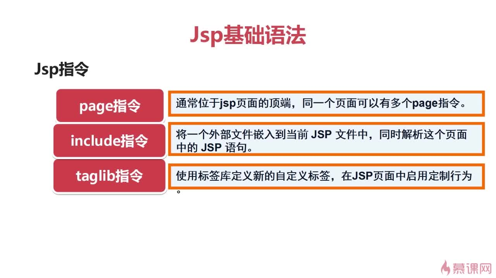
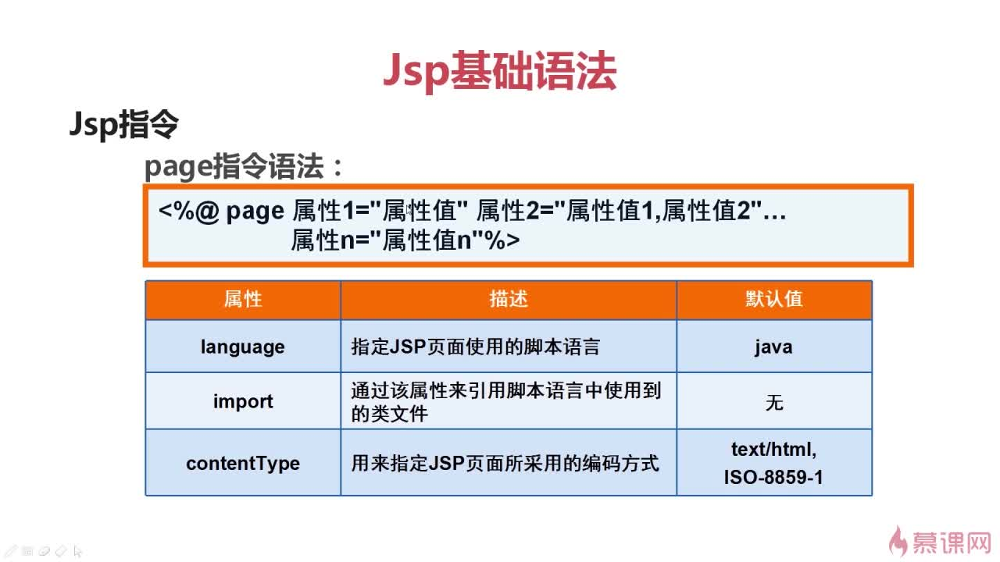
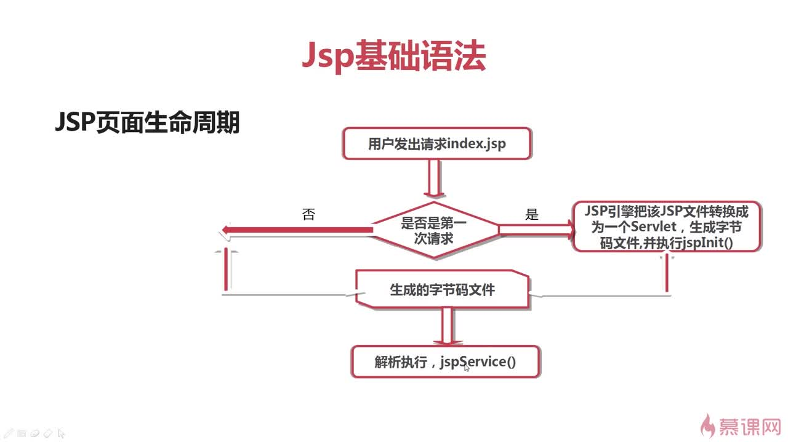
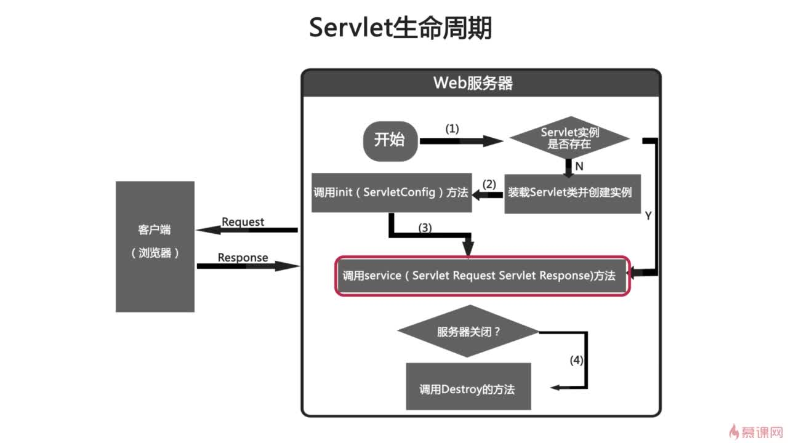
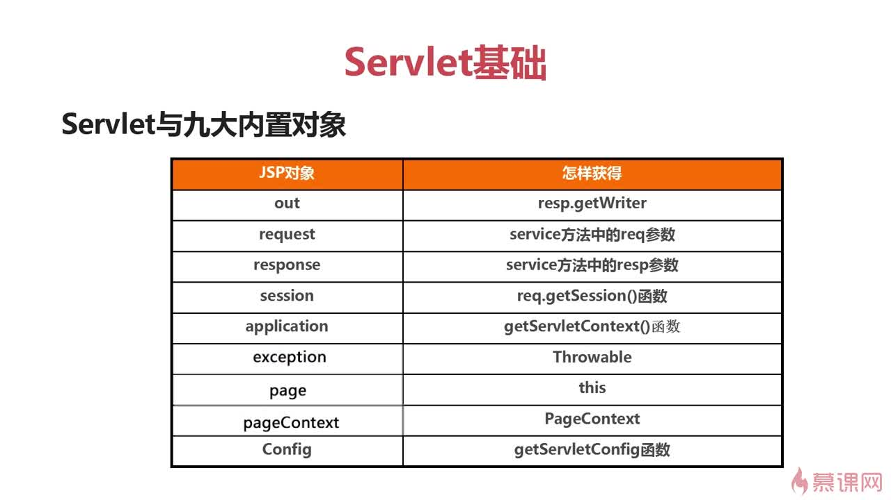
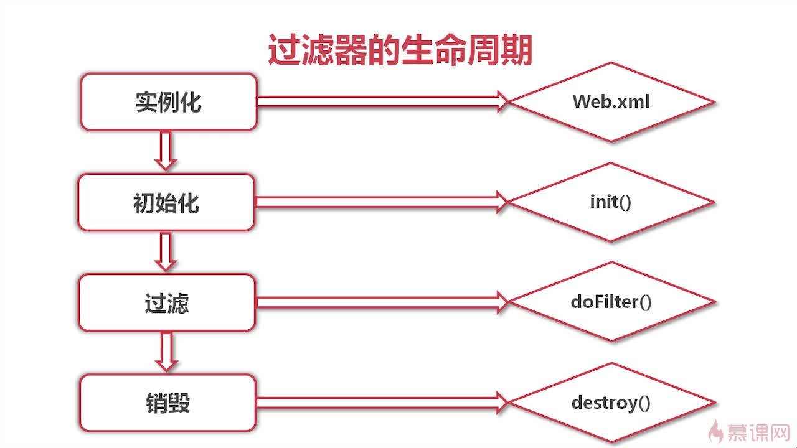
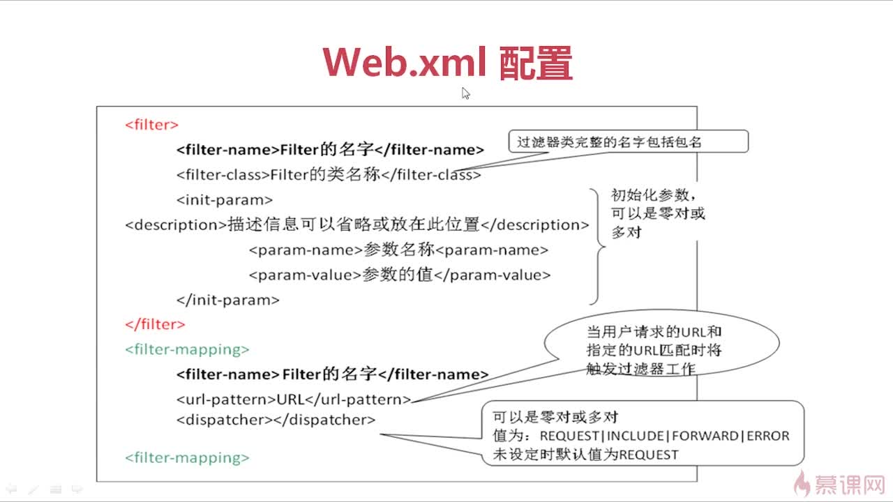
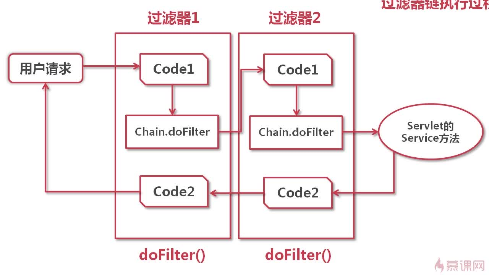
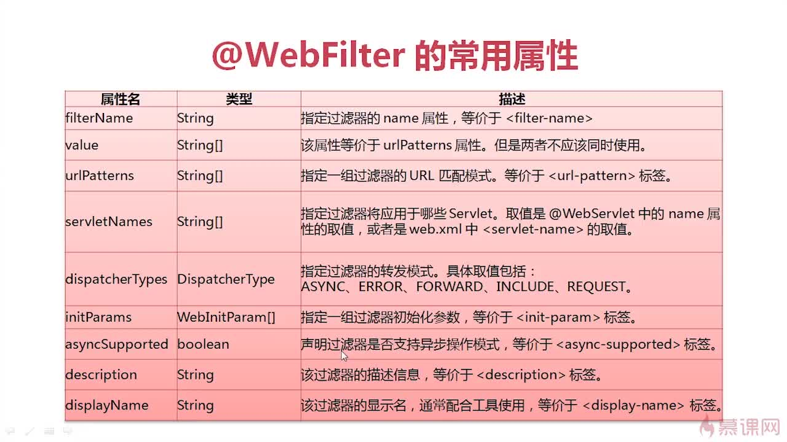
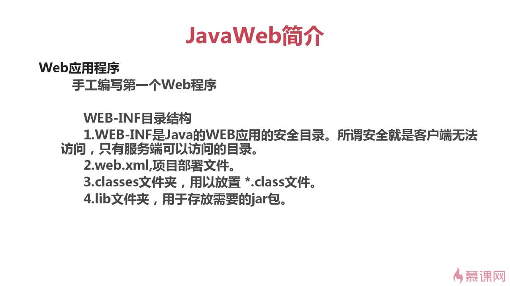

# Java Web

相关 maven 依赖：

```
<dependency>
    <groupId>javax.servlet</groupId>
    <artifactId>javax.servlet-api</artifactId>
    <version>3.0.1</version>
    <scope>provided</scope>
</dependency>
<dependency>
    <groupId>taglibs</groupId>
    <artifactId>standard</artifactId>
    <version>1.1.2</version>
</dependency>
<dependency>
    <groupId>jstl</groupId>
    <artifactId>jstl</artifactId>
    <version>1.2</version>
</dependency>
```

servlet3.0 web.xml:

```
<?xml version="1.0" encoding="UTF-8"?>
<web-app xmlns:xsi="http://www.w3.org/2001/XMLSchema-instance"
         xmlns="http://java.sun.com/xml/ns/javaee"
         xsi:schemaLocation="http://java.sun.com/xml/ns/javaee http://java.sun.com/xml/ns/javaee/web-app_3_0.xsd"
         metadata-complete="true" version="3.0">
    <!-- 修改servlet为3.0版本 -->
    <welcome-file-list>
        <welcome-file>index.jsp</welcome-file>
    </welcome-file-list>

 </web-app>

```

### JSP

JSP 简介:

> 全名 Java server pages，其根本是一个简化的 servlet 设计，他实现了在 Java 中使用 HTML 标签。JSP 是一种动态网页技术标准也是 javaee 的标准。和 servlet 一样在服务端运行。

#### JSP 语法

JSP 指令:



page 指令:



`page指令:`

```
<%@ page contentType="text/html;charset=UTF-8" language="java" import="java.util.*" %>
```

`taglib指令:`

```
<%@ taglib prefix="fmt" uri="http://java.sun.com/jsp/jstl/fmt" %>
<%@ taglib prefix="c" uri="http://java.sun.com/jsp/jstl/core" %>
<%@ taglib prefix="fn" uri="http://java.sun.com/jsp/jstl/functions" %>
```

`include指令:`

> 引入共通的 JSP 页面,最后编译成一个 Servlet

示例：引入(`WEB-INF/jsp/common/header.jsp`)

`header.jsp`:

```
<%@ taglib prefix="fmt" uri="http://java.sun.com/jsp/jstl/fmt" %>
<%@ taglib prefix="c" uri="http://java.sun.com/jsp/jstl/core" %>
<%@ taglib prefix="fn" uri="http://java.sun.com/jsp/jstl/functions" %>
<%
    // web上下文路径
    String path = request.getContextPath();
    String basePath = request.getScheme()+"://"+request.getServerName()+":"+request.getServerPort()+path+"/";
    request.setAttribute("basePath", basePath);
%>

```

`在别的 JSP 页面引入`：

```
<%@ include file="/WEB-INF/jsp/common/header.jsp"%>
```

`针对所有JSP的全局引入`：

> 在 web.xml 添加配置

```
<jsp-config>
    <jsp-property-group>
        <url-pattern>*.jsp</url-pattern>
        <include-prelude>/WEB-INF/jsp/common/header.jsp</include-prelude>
    </jsp-property-group>
</jsp-config>

```

`JSP 注释`：

1. html 注释：`<!-- HTML注释 -->` 客户端可见

2. `<%-- JSP 注释 --%>` 客户端不可见

3. jsp 脚本注释（客户端不可见）： `//单行注释` `/**/多行注释`

`JSP 脚本`：

> 在 JSP 页面中执行的 java 代码。语法：`<% Java代码 %>`

`JSP 声明`：

> 语法：`<%！ java代码 %>`

`Jsp 表达式`:

> 语法：`<%=表达式|已定义变量%>`

引用`basePath`变量：

```
<head>
    <base href="<%=basePath%>">
    <meta charset="UTF-8">
    <title>index.jsp</title>
</head>
```

#### JSP 页面生命周期



> jspService()用来处理客户端的请求。
> 对每一个请求，JSP 引擎创建一个新的线程来处理该请求。每个客户端请求对应一个线程。
> 如果有多个客户端同时请求该 JSP 文件，则 JSP 引擎会创建多个线程。以多线程方式执行可以大大降低对系统的资源需求，提高系统的并发量及响应时间。但也要注意多线程的编程带来的同步问题，由于该 Servlet 始终驻于内存，所以响应是非常快的。

#### JSP 九大内置对象

> jsp 内置对象：web 容器创建的一组对象，不使用 new 就可以使用的内置对象

- `out`

  > out 对象:是 JSPWriter 类的实例，是向客户端输出内容常用的对象。

- `request`

  > 客户端的请求信息被封装在 request 对象中，通过它才能了解到客户的需求，然后做出响应。它是 `HttpServletRequest` 类的实例。request 对象具有请求域，即完成客户端的请求之前，该对象一直有效。

- `response`

  > response 对象包含了响应客户请求的有关信息。它是 `HttpServletResponse` 类的实例。response 对象具有页面作用域,即访问一个页面时，该页面内的 response 对象只能对这次访问有效,其他页面的 response 对象对当前页面无效。

  获取输出流对象`PrintWriter response.getWriter()`

- `session`

  > session 表示客户端与服务器的一次会话，是 `HttpSession` 类的实例。web 中的 session 指的是用户在游览某一个网络时从进入网站到游览器关闭所经过的这段时间，也就是用户游览这个网站所花费的时间，session 实际上时一个特定的时间概念.

  在服务器的内存中保存着不同用户的 session

  web.xml 设置 session 超时时间

  ```

    <session-config>
       <!-- 设定超时销毁时间(分钟) 然而这个时间并不精确，而且当为0的时候表示无超时销毁  -->
        <session-timeout>1</session-timeout>
    </session-config>

  ```

- `application`

  > `ServletContext` 类的实例；实现用户间数据的共享，可存放全局变量，开始于服务器的启动，终止于服务器的关闭，在用户的前后连接或不同用户之间的连接，可以对 application 对象的同一属性进行操作；在任何地方对 application 对象属性的操作都会影响到其他用户对此的访问；服务器的启动和关闭决定了 application 对象的声明

- `page`

  > page 对象就是指向当前 jsp 页面本身

- `pageContent`

  > pageContext 对象提供了对 JSP 页面内所有对象及名字空间的访问
  > pageContext 对象可以访问本页所在的 session,也可以取本页面所在的 application 的某一属性值。pageContext 对象相当于页面中的所有功能的集大成者。pageContext 对象的本类名也叫 pageContext。

- `exception`

  > Exception 对象：异常对象,java.lang.Throwable 的对象，若一个 JSP 页面要应用此对象，必须把 isErrorPage 设为 true 否则无法编译。

- `config`

  > config 对象是在一个 Servlet 初始化时,JSP 引擎向它传递信息用的,此信息包括 Servlet 初始化时所要用到的参数(通过属性名和属性值构成)以及服务器的有关信息(通过传递一个 ServletContext 对象)

#### 请求转发与请求重定向之间的区别

1. 请求转发：服务器行为，`request.getDispatcher().forward(req,resp)`;是一次请求，相当于在前一个地址进行的，转发后请求对象内容会保存，地址栏 url 地址不会改变（即为前一个地址）

2. 请求重定向：客户端行为，`resonse.sendRedirect()`.其实相当于两次请求，前一次的请求对象不会保存，地址栏 url 会改变（新页面）

#### cookie

> cookie 是 web 服务器保存在客户端的一系列文本信息

创建 Cookie 对象:

```
Cookie newCookie=new Cookie（String key,Object value）;
```

写入 Cookie 对象:

```
response.addCookie(newCookie);
```

读取 Cookie 对象:

```
Cookie[] cookies=request.getCookies();
```

### Servlet

> Servlet 是在服务器上运行的小程序。一个 Servlet 就是一个 java 类，并且可以通过“请求-响应”编程模型来访问的这个驻留在服务器内存里的 Servlet 程序

编写 servlet 步骤：

- 继承 `HttpServlet`

- 重写 `doGet()`或者 `doPost()` 方法

- 在 `web.xml` 中注册 `Servlet`

#### Servlet 执行流程和生命周期



#### Tomcat 装载 Servlet 的三种情况

1. 在 web.xml 文件中的`<Servlet></Servlet>`之间添加`<loadon-starup>1</loadon-startup>` 会在服务器启动时加载 servlet， 数字越小优先级越高
2. 首次访问 Servlet，服务器会加载 Servlet

3. servlet 类被修改的时候，也会自动装载

#### servlet 与九大内置对象



### Filter 过滤器

> 过滤器是一个`服务器端`的组件，它可以`截取用户端的请求和响应信息`，并对这些信息过滤

#### Filter 过滤器的生命周期

> `实例化`和`初始化init()`只执行一次（服务器启动时），`doFilter()` 每次拦截请求都执行



编写 Filter 步骤：

1. 实现`javax.servlet.Filter`接口

2. 重写三个方法`init()` `doFilter()` `destroy()`方法

   > init()初始化：这个方法可以读取 web.xml 文件中的过滤器初始化参数。通过参数`FilterConfig`对象可以获取更多参数

   > doFIlter()核心：完成实际的过滤操作。

3. 在`web.xml`配置过滤器

   

#### Filter 过滤器链



#### Filter 分类

- request
- forward
- include
- error

#### `@webfilter`注解



### Listener 监听器

> Web 监听器由 Servlet 规范提供的,可以监听客户端的请求以及服务端的操作,即监听 `ServletContext`、`HttpSession`、`ServletRequest` 对象.监听事件分为这三个对象的创建、销毁事件以及这三个对象属性的变化事件.可以在事件发生前后做一些处理。

#### 创建 Web 监听器

步骤：

1. 创建一个实现监听器接口的类

2. 配置 web.xml 进行监听器注册(或者使用`@WebListener`注解)

#### 监听器|过滤器|servlet 启动顺序

> 加载顺序：监听器>过滤器>servlet

#### 监听器分类

1. 按监听器的对象划分：

   - 监听(`实现ServletContextListener接口`)应用程序环境对象(`ServletContext`)的事件监听器
   - 监听(`实现HttpSessionListener接口`)用户会话对象(`HttpSession`)的事件监听器
   - 监听(`实现ServletRequestListener接口`)请求消息对象(`ServletRequest`)的事件监听器

`ServletContextListener`代码：

```
<!-- web.xml web上下文参数 -->
<context-param>
        <param-name>param</param-name>
        <param-value>hello world</param-value>
</context-param>
```

```
import lombok.extern.slf4j.Slf4j;

import javax.servlet.ServletContextEvent;
import javax.servlet.ServletContextListener;
@Slf4j
public class contextListener implements ServletContextListener {


    public contextListener() {
        log.info("contextListener()");
    }

    // ServletContext创建时调用
    @Override
    public void contextInitialized(ServletContextEvent sce) {
        log.info("contextInitialized");
        String param = sce.getServletContext().getInitParameter("param");
        if (param != null) {
            log.info("ServletContext 获得初始化参数 param={}", param);
        }
    }

    // ServletContext销毁时调用
    @Override
    public void contextDestroyed(ServletContextEvent sce) {
        log.info("contextDestroyed");
    }
}
```

`HttpSessionListener`:

```
import lombok.extern.slf4j.Slf4j;

import javax.servlet.http.HttpSession;
import javax.servlet.http.HttpSessionEvent;
import javax.servlet.http.HttpSessionListener;


@Slf4j
public class SessionListener implements HttpSessionListener {


    public SessionListener() {
        log.info("SessionListener()");
    }

    //  session创建时调用
    @Override
    public void sessionCreated(HttpSessionEvent se) {
         HttpSession session = se.getSession();
         log.info("产生一个session id={}",session.getId());
    }

    // session 销毁时调用
    @Override
    public void sessionDestroyed(HttpSessionEvent se) {
        HttpSession session = se.getSession();
        log.info("销毁session id={}",session.getId());
    }
}
```

`ServletRequestListener:`

> 监听 http 请求

```
package com.imooc.listener;

import lombok.extern.slf4j.Slf4j;

import javax.servlet.ServletRequestEvent;
import javax.servlet.ServletRequestListener;
import javax.servlet.http.Cookie;
import javax.servlet.http.HttpServletRequest;


@Slf4j
public class RequestListener implements ServletRequestListener {

    public RequestListener() {
        log.info("RequestListener()");
    }


    @Override
    public void requestInitialized(ServletRequestEvent sre) {
        HttpServletRequest request = (HttpServletRequest) sre.getServletRequest();
        Cookie[] cookies = request.getCookies();
        boolean JSESSIONID_exist = false;
        String JSESSIONID = null;
        if (cookies != null && cookies.length > 0) {
            for (Cookie cookie : cookies) {
                if (!"JSESSIONID".equals(cookie.getName())) {
                    continue;
                }
                JSESSIONID_exist = true;
                JSESSIONID = cookie.getValue();
            }
        }
        if (JSESSIONID_exist) {
            log.info("产生一个request url={},JSESSIONID={}", request.getServletPath(), JSESSIONID);
        } else {

            log.info("产生一个request url={}", request.getServletPath());
        }
    }

    @Override
    public void requestDestroyed(ServletRequestEvent sre) {
        HttpServletRequest request = (HttpServletRequest) sre.getServletRequest();
        Cookie[] cookies = request.getCookies();
        boolean JSESSIONID_exist = false;
        String JSESSIONID = null;
        if (cookies != null && cookies.length > 0) {
            for (Cookie cookie : cookies) {
                if (!"JSESSIONID".equals(cookie.getName())) {
                    continue;
                }
                JSESSIONID_exist = true;
                JSESSIONID = cookie.getValue();
            }
        }
        if (JSESSIONID_exist) {
            log.info("完成和销毁一个request url={},JSESSIONID={}", request.getServletPath(), JSESSIONID);
        } else {

            log.info("完成和销毁一个request url={}", request.getServletPath());
        }

    }
}
```

### WEB 资源目录

> WEB 资源目录在 maven-webapp 工程里为`webapp(src/main/webapp)`目录,是 WEB 工程发布的根目录，打包时`webapp`下的所有资源会被打包到`工程名.war`文件。`war` 文件可直接放到`tomcat`服务器的`webapps`下启动，此时访问 web 应用需要带上 web 工程名(如:`http://localhost:8080/web工程名`)。将 war 文件重命名为`ROOT.war`可直接通过(`http://localhost:8080/`)访问。

#### war 文件的 WEB-INF 目录结构



- `classes` 存放 java 编译后生成的`.class`文件

- `lib` 存在 maven 依赖的 jar

#### 获取 web 应用的上下文路径

> web 应用可以发布到 tomcat 的根目录或者加上项目名；加上项目名的 web 应用需要使用`/web工程名/xxxx`才能访问真实的映射路径。

下面的代码能获取 web 应用发布的根路径：

```
<%
    String path = request.getContextPath();
    String basePath = request.getScheme()+"://"+request.getServerName()+":"+request.getServerPort()+path+"/";
    request.setAttribute("path",path);
    request.setAttribute("basePath", basePath);
%>
```
