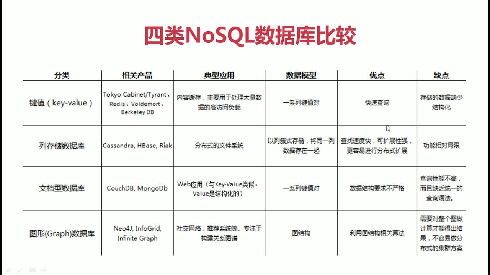

### 什么是 NoSQL

- NoSQL = Not Only SQL
- 非关系型数据库

### 为什么使用 NoSQL

- 高并发读写
- 海量数据存储和访问
- 高可拓展和可用性

### Nosql 数据库比较



### redis 数据类型


### Redis 应用场景

1.  缓存
2.  任务队列
3.  应用排行榜
4.  网站访问统计
5.  数据过期处理
6.  分布式集群架构中的 Session 分离

### web

- <https://redis.io/>
- <https://github.com/MSOpenTech/redis/releases>

### win 安装

1. win 添加 redis 到系统服务(以配置文件启动,多个 redis 修改端口号),在 redis 安装目录下创建.bat 文件，添加:

   ```
   @echo off
   cd /d %~dp0
   redis-server.exe --service-install redis.windows.conf --loglevel verbose     --service-name Redis6379
   pause
   ```

2. redis 启动后生产 RedisQFork_xxx.dat 文件占用用户目录;修改 redis.windows.conf 中的 heapdir,改为安装目录

### 常用命令

```
# connect
redis-cli -p 6379
# 监听
monitor
# 删除
flushdb
# 过期时间 -1:表示永久
ttl
# 数据类型
type key
# 获得keys
keys *
# 是否存在
exists key
# 重置有效期
expire key
```

### String 类型

```
1. set key value
设置key的value值

2. get key
获取key的value值

3. getset key value
先获取key的value值，再重新赋值

4. del key
删除key键

5. incr key
为key的value值+1，若key不存在，则把value赋值为0后+1；若value数据类型不为integer，则报错。

6. decr key
为key的value值-1，若key不存在，则把value赋值为0后-1；若value数据类型不为integer，则报错。

7. append key
追加字符串
```

### hash 类型

```
1. 存储k/v
 hset key k v

2. 取k对应的v
 hget key k

3. 删除键k
hdel key k

4. 对k加上一个增量(可以为负)
 hincrby key k delta

5. 对k加上一个浮点数(可以为负)
 hincrbyfloat key k delta

6. 存储多个k/v对
 hmset key k1 v1 k2 v2 ... kn vn

7. 取多个k对应的值
 hmset key k1 k2 ... kn

8. 取所有的k/v对
 hgetall

9. 取所有的键的值
 hvals key

10. 取键值对的个数
 hlen key

11. 取所有键名
 hkeys key

12. 判断是否存在k
 hexists key k
```

### list 类型

```
1. 从左侧添加数据 若key不存在 为其创建一个list
 lpush key str1,str2……strn

2. 从右侧添加数据 若key不存在 为其创建一个list
 rpush key str1,str2……strn

3. 查看指定角标之间的元素 角标可为负数，-1为最后一个元素，以此类推
 lrange key start,end

4. 弹出左侧第一个元素
 lpop key

5. 弹出右侧第一个元素
 rpop key

6. 获取列表中元素个数
 llen key

7. 向列表头部插入val 仅当key存在时可用 返回值为lit的长度
 lpushx key val

8. 删除列表中count个值为val的元素 count>0从头向尾遍历 count<0 从尾向前 若 count =0 删除所有值为val的元素
 lrem key count val

9. 将列表中角标为index的元素的值设为val
 lset key index val

10. 在指定元素val前插入数据str
 linsert key before val str

11. 在指定元素val后插入数据str
 linsert key after val str
```

### set

- Set 集合中不允许出现重复的元素
- 使用场景:跟踪一些具有唯一性的数据

```
1. 添加值、从左端添加
 sadd [setname] [value1][value2]..

2. 删除值
 srem [setname] [value1][value2]..

3. 查看set集合
 smember  [setname]

4. 判断值是否存在 返回1存在；0不存在
 sismember [setname] [value]

5 .差集运算，[setname1]多余的、注意顺序
 sdiff [resultSetName] [setname1] [setname2]

6. 交集运算
 sinter [resultSetName] [setname1] [setname2]
```

### sortedSet

- 字符串集合，不允许元素重复。存储元素时需要关联存储一个对应的分数，分数用于排序。元素不可重复但分数可重复。成员在集合中的位置是有序的。
- 使用场景：排行榜

```
1. 添加元素
 zadd [sortname] [score1][value1][score2][value2]

2. 删除
 zrem [sortname] [value]

3. 显示value的分数
 zscore [sortname]  [value]

4. 查询长度
 zcard [sortname]

5. 查询区间内的值、是否返回分数 从小到大
 zrange [sorename] [start] [stop] [witchscores]

6. 查询区间内的值、是否返回分数 从大到小
 zrange [sorename] [start] [stop] [witchscores]
```

### redis 持久化

- RDB（默认支持的，不需要配置）：在指定时间间隔内，将内存中的数据和快照写入磁盘
  ```
    优势：性能最大化,可以开启小的进程处理持久化操作、可以将数据保存为一个文件,便于备份、方便可移植性
    劣势：可能会出现数据丢失的问题，在持久化时间没到的时候丢失的数据无法找回、当数据过大,进程处理将会延迟几百秒到一千毫秒
  ```
- AOF：以日志的形式记录服务器处理的每一个操作，在 redis 服务器启动之初会读取该文件，重新构建数据库，保证启动后数据库中的数据是完整的

  ```
    优势：
         1. 带来更高的数据安全性。有三种同步策略。每秒同步、每修改同步、不同步。
         2. AOF 文件是一个只进行追加操作的日志文件，因此在写入过程中即使出现宕机现象也不影响之前已经存在的内容。
         3. 如果日志过大，redis可以启动重写机制。在重写过程中产生的对数据库操作记录会保存在一个新文件中，等到重写完成后再追加到现有的文件中。
         4. AOF 文件有序地保存了对数据库执行的所有写入操作
    劣势：
         1. 对于相同数量的数据集而言，文件比rdb方式要大。
         2. 效率比rdb低
    启用：
        # 修改redis.conf
         appendonly yes
    同步策略：
        appendfsync always(每次操作同步，效率低，最安全)
        appendfsync everysec（每秒同步）
        appendfsync no（不同步）
  ```
