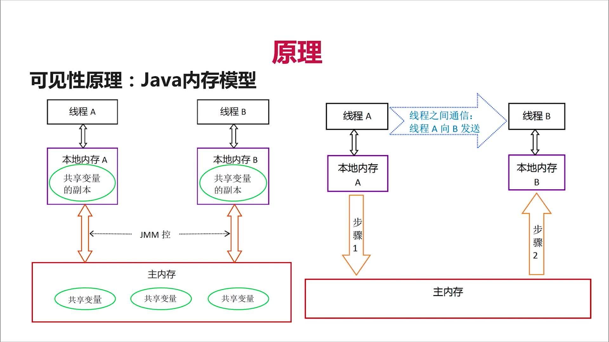

# synchronized 深度解析

#### synchronized 简介

能够保证在同一时刻最多只有一个线程执行该代码段，以保证并发安全的效果。

#### 多线程访问同步方法的几种情况

1. 同时访问同一个对象的同步方法

   锁定当前对象，不同线程竞争同一把锁，同一时刻只能有一个线程执行同步方法

2. 不同线程访问不同对象的同步方法

   锁定的不是同一对象，不相互影响执行过程

3. 不同线程访问同步(synchronized)的静态(static)方法

   锁定当前类，不同线程会顺序执行同步方法

#### 可见性原理

