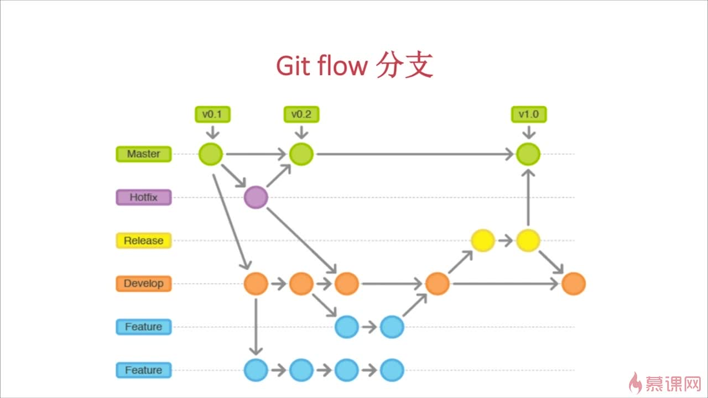

##  Git

#### github 账号

微软 outlook 邮箱

#### git 配置

&nbsp;&nbsp;在使用 git 之前你需要配置一下 git。git 在你创建提交的时候会记录你的名字和 email 地址，所以你应该告诉 git 这些内容。可以使用'git config'命令来设置。

```
git config --list
git config --global user.name "你的用户名"
git config --global user.email "你的邮箱"
git config --global core.autocrlf false

```

#### 创建 SSH Key

- 创建 SSH Key： ssh-keygen -t rsa -C 你的邮箱
- 将生成的 id_rsa.pub 里面的内容复制到 github 的 add ssh 中
- 验证 github: ssh -T git@github.com
- 验证 gitee: ssh -T git@gitee.com

#### gist.github.com 被墙无法访问解决办法

&nbsp;&nbsp;windows 下 打开 C:\Windows\System32\drivers\etc\hosts 文件 编辑器打开，在最后行添加 192.30.253.118 gist.github.com

#### 创建本地仓库并推送到远程的过程

1. 在远程创建 repository,获得远程仓库地址(https/ssh)如：https://github.com/lujiandi/mmall.git
2. 新建一个目录 [project-name]
3. 创建配置 .gitignore 文件，忽略指定类型的文件和目录。
4. 创建文件 README.md
5. 项目初始化(git init)
6. 添加文件(单个文件指定文件名)

   ```
   git add .

   ```

7. 提交本地

   ```
   git commit -am "commit message"

   ```

8. 连接到远程

   ```
   git remote add origin https://github.com/lujiandi/mmall.git

   ```

9. 推送到远程 xxx 分支(强制推 加上 -f )

   ```
   git push -u origin xxx

   ```

#### 其它命令

1. 状态(查看有哪些文件发生变化)

   git status

2. 查看 tag

   git tag

3. 添加 tag

   git tag -a vx.x.x -m "vx.x.x 版本"

4. 推送 tag

   git push -u origin xxxx

5. 删除 tag

   git tag -d xxx

6. 删除远程 tag

   git push origin :refs/tags/xxxx

7. 查看分支

   git branch

   git branch -a #查看远程分支

   git branch -r

8. 根据原有分支创建进切换到新分支

   git checkout -b v1.0 origin/master

9. 切换分支

   git checkout xxx

10. 删除分支

    git branch -d xxxx

11. 删除远程分支

    git push origin --delete xxxx

12. (拉)更新远程到本地，

    git pull

13. log 本地提交记录 可以回到过去

    git log

14. reflog 当前版本的记录

    git reflog

15. 取消暂存

    git reset HEAD fileName

16. 恢复文件

    git checkout fileName

17. 本地回到某次提交的版本(影响所有文件)

    git reset --hard 04f76726c53d58992dfb2d55417b0eb9452c75b2

18. diff(没有 commit)

    git diff <file> #比较工作区与暂存区文件的差异

19. merge 合并 xxx 到前分支

    git merge xxx

20. 下载一个项目和它的整个代码历史

    git clone [url]

21. 远程关联

    git remote -v ：查看远程关联

    git remote add xxx 远程地址 ：关联远程,xxx 为远程仓库名，git push -u xxxx 本地分支

    git remote remove xxx :取消关联

#### gitflow


