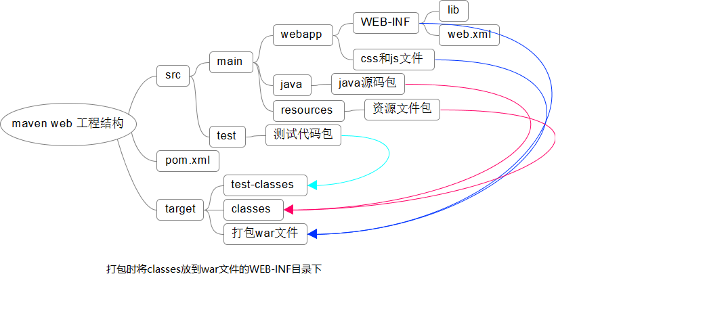

# maven

#### 安装

1. 设置系统环境变量 `M2_HOME`(maven 安装目录)
2. `Path` 添加 `%M2_HOME%/bin`

#### 常用命令

- mvn test
- mvn clean
- mvn compile
- mvn package -Dmaven.test.skip=true -P 环境变量

#### maven 中如何指定 jdk 的版本

1. 全局配置:指在 \${MAVEN_HOME}\conf\settings.xml 中进行配置，例如，要配置 jdk1.8, 打开 settings.xml 这个文件，然后在 \<profiles> \</profiles> 之间添加如下代码

   ```
   <profile>
   <id>jdk1.8</id>
   <activation>
   <activeByDefault>true</activeByDefault>
   <jdk>1.8</jdk>
   </activation>
   <properties>
   <maven.compiler.source>1.8</maven.compiler.source>
   <maven.compiler.target>1.8</maven.compiler.target>
   <maven.compiler.compilerVersion>1.8</maven.compiler.compilerVersion>
   </properties>
   </profile>
   ```

   全局配置的好处就是省事、方便。一次配置以后，再使用 maven 构建项目，项目编译
   时，默认使用 jdk1.8 进行编译。

2. 局部配置就是只针对具体某个项目进行配置的。具体就是，在项目的 pom.xml 文件中
   添加如下代码

   ```
   <build>
   <plugins>
   <plugin>
   <groupId>org.apache.maven.plugins</groupId>
   <artifactId>maven-compiler-plugin</artifactId>
   <configuration>
   <source>1.7</source>
   <target>1.7</target>
   </configuration>
   </plugin>
   </plugins>
   <build>
   ```

#### 阿里云 maven 镜像

```
    <mirror>
      <id>alimaven</id>
      <mirrorOf>central</mirrorOf>
      <name>aliyun maven</name>
      <url>http://maven.aliyun.com/nexus/content/groups/public/</url>
    </mirror>
```

#### maven webapp 项目结构



#### maven plugins

```
// tomcat
<plugin>
   <groupId>org.apache.tomcat.maven</groupId>
   <artifactId>tomcat7-maven-plugin</artifactId>
   <version>2.2</version>
   <configuration>
       <path>/</path>
       <port>8080</port>
       <uriEncoding>UTF-8</uriEncoding>
   </configuration>
</plugin>

```
