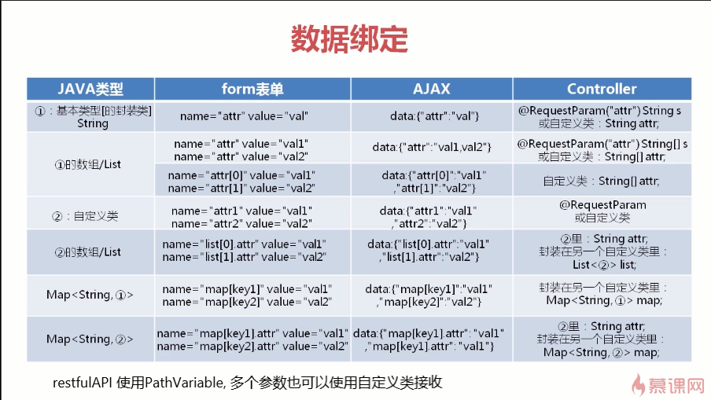

# SpringMVC 实现多种数据类型绑定



#### 绑定基本数据类型

Java 基本数据类型 int 的默认值是 0，在使用 int 进行 url 传递参数时，参数 key 是必须写的，其值也只能是 int 类型的，否则将会报错。

比如方法：

```
@RequestMapping(value = "baseType.do")
 @ResponseBody //返回的数据放到 ResponseBody 的数据区中
 public String baseType(int age){
 return "age:"+age;
 }
```

请求的 url 地址：http://localhost:8080/baseType.do?age=10，其中参数age是必传的，其值只能是int类型的；
如果不传，将会报 500 错误。
比如：

http://localhost:8080/baseType.do

如果传递了，但是数据类型是其他类型，将会报 400 错误，比如：

http://localhost:8080/baseType.do?age=abc

又比如方法：

```
@RequestMapping(value="baseType1.do")
 @ResponseBody
 public String baseType1(@RequestParam(value="xage")int age){
 return "age: " + age;
 }
```

我们可以使用`@RequestParam` 注解来为传入的参数，定义一个别名参数，
@RequestParam（value="",required = true）value 参数别名 required 该参数是否必传，默认为 true；
访问的 url 地址如下：

http://localhost:8080/baseType1.do?xage=10

同样 xage 这个参数也是必传的，其类型为 int。

如果是其他基本数据类型也是如此，其中
byte,short,int 的默认值都为 0，long 的默认值为 0L,float 的默认值为 0.0f，double 的默认值为 0.0d
在进行数据绑定时，其参数值必传，其值的类型为其对应的基本数据类型。

#### 绑定包装数据类型

Java 封装类型 Integer 的默认值为 null，在使用 Integer 进行 url 数据传递时，参数 key 可以不传，对应参数的值就会默认为 null。
比如方法：

```
@RequestMapping(value = "baseType2.do")
 @ResponseBody
 public String baseType2(Integer age){
 return "age:"+age;
 }
```

其 url 地址参数 age 可以不传，也可以传，对应的 url 地址如下：

http://localhost:8080/baseType2.do?age=10

http://localhost:8080/baseType2.do

但是如果传递了 age 参数，其值为其他数据类型，将会报 400 错误，比如：

http://localhost:8080/baseType2.do?age=abc

数据绑定的数值型接受参数可以是基本类型和包装类型，但二者有区别：

1. 基本类型不可接受空值，会报错。且输入数值必须在指定数据类型的数据范围内
2. 包装类型则可以接受空值，具有优势，推荐使用，比如传递的参数是年龄、身高、长度、宽度等，具体情况可根据业务需要进行变更

#### 绑定数组类型

Java 数组：它是一个具有相同数据类型，固定大小的对象。
绑定数组类型的方法如下：

```
@RequestMapping(value = "array.do")
 @ResponseBody
 public String array(String[] name){
 StringBuilder sbf = new StringBuilder();
 StringBuffer sb = new StringBuffer();
 for(String item : name){
 sbf.append(item).append(" ");
 }
 return sbf.toString();
 }
```

在使用 url 地址传递参数时，一次可以传递多个参数值，值与值之间使用&分开，如下：

http://localhost:8080/array.do?name=Tom&name=Lucy&name=Jim

#### 绑定对象类型

这里以绑定 User 对象为例，绑定的方法如下：

```
@RequestMapping(value="/user")
@ResponseBody
public String GetUser(User user){
 return user.toString();
}
```

使用 url 传递参数的方式如下：

http://localhost:8080/user?name=Tom&age=10

其中 name、age 都是 User 对象的属性。

对象类型的数据绑定，直接请求时对应其属性即可，不必添加前缀，如 User 类的属性 name，则直接在请求中使用 name=xxx，而不是使用 user.name=xxx 的形式。url 如下：

http://localhost:8080/user?name=Tom&age=10

但如果是想对对象中对象的属性再赋值的话，则需要使用 xxx.xxx 的形式，如下的 contactInfo.phone 表示将 User 类中的 ContactInfo 类的 phone 属性赋值。 如下：

http://localhost:8080/object.do?name=Tom&age=10&contactInfo.phone=10086

#### 两个对象同属性进行数据绑定

这里以 User 对象和 Admin 对象为例，这两个对象具有相同的属性 name，age，这两个对象进行数据绑定的方法如下：

```
@RequestMapping(value = "object.do")
@ResponseBody
public String object(User user,Admin admin){
 return user.toString()+" "+admin.toString();
}
```

在这里是有 Spring 注解`@InitBinder` 来初始化一个对象。

对于两个不同的类，遇到同名属性的情况，SpringMVC 会默认针对所有类的同名属性赋值，如下面 url 传递的 name，age 参数将是两个对象共有的：

http://localhost:8080/object.do?name=Tom&age=10

如果想要区别对待，直接使用 xxx.xxx 的形式是不行的，还需要在对应的 Controller 中定义方法，以 `@InitBinder` 注解标记属性名，形参使用 `WebDataBinder` 来定义请求参数前缀，若没加前缀则是共有的。方法定义如下：

```
@InitBinder("user") //@InitBinder 初始化一个对象
public void initUser(WebDataBinder binder){
 binder.setFieldDefaultPrefix("user.");
}
@InitBinder("admin")
public void initAdmin(WebDataBinder binder){
 binder.setFieldDefaultPrefix("admin.");
}
```

使用 url 传递参数，如下：

http://localhost:8080/object.do?user.name=Tom&admin.name=Lucy&age=10

其中 age 参数是两个对象共用的。

#### 绑定 List 对象

Java 中 List 集合类型：List 是一个有序，可重复的的线性表。

在绑定 List 对象数据时，首先要将对象封装为 List 对象，并设置它的 get/set 方法，以 User 对象为例，封装如下：

```
private List users;
```

然后 controller 下对应的方法定义如下：

```
@RequestMapping(value = "list.do")
@ResponseBody
public String list(UserListForm userListForm){
     return "listSize:"+userListForm.getUsers().size() + "  " + userListForm.toString();
}
```

其中 UserListForm 是封装的 List 对象类，使用 url 传递参数的方式如下：

http://localhost:8080/list.do?users[0].name=Tom&users[1].name=Lucy

Controller 中 List 参数不能直接传值，需要一个包裹类，类中有需要传的 List 作为属性和对应的 get,set 方法。 传值时用 users[0].name = Tom users[1].name = Luce 一定不要跳跃传值，如 users[0].name = Tom&users[20].name = Lucy 这样中间的 1~19 也会占用资源属性值为空。

http://localhost:8080/list.do?users[0].name=Tom&users[1].name=Lucy&users[20].name=Jim

#### 绑定 Map 对象

Java 中 Map 集合对象：Map 是一个基于 kay-value 键值对的集合类型，它是无序的，其中键 key 不可重复，值 value 可以重复。

在绑定 Map 对象数据时，首先要将对象封装为 Map 对象，并设置它的 get/set 方法，以 User 对象为例，封装如下：

```
private Map<String,User> users;
```

然后 controller 下对应的方法定义如下：

```
@RequestMapping(value = "map.do")
 @ResponseBody
 public String map(UserMapForm userMapForm){
 return userMapForm.toString();
 }
```

其中 UserMapForm 是封装的 Map 对象，使用 url 传递参数的方式如下：

http://localhost:8080/map.do?users[‘X’].name=Tom&users[‘X’].age=10&users[‘Y’].name=Lucy

其中 X,Y 是 key，类型是 String 类型。

#### 绑定 Set 对象

Java 中 Set 集合对象：Set 集合无序，且不可重复，因为它重写了 hashCode()方法和 equals()方法；
Set 集合在实际的应用中，常用于对象的重复判断或者排除重复。

在 SpringMVC 中绑定 Set 数据类型，接口的参数形式和绑定 list 是类似的，都是通过索引。但是不同的在于，Set 必须初始化，它必须先包含了初始化对象，也即是说必须提前手动分配好空间，才能进行赋值，而使用 List 则没有这个要求。

另外的一个坑在于，初始化 Set 时需要留意对象的 equals 方法，假如我们在提前分配两个对象空间时，两个对象通过 equals 方法判断为相同，则我们期望的 Set 的 size 为 2，最后实际因为去重变成了 1，导致在数据绑定时很容易出现数组越界的异常。

Set 集合类型：我们一般用来排重 使用 Set 的时候需要先进行初始化 要使用 Set 的排重功能必须在对象中覆写 hashcode 和 equals 方法。 SpringMVC 对 Set 支持并不太好，初始化进行排重时会导致 size 变小，致使无法接受更多的数据而抛出异常，所以我们开发一般优先使用 List。

在绑定 Set 对象数据时，首先要将对象封装为 Set 对象，并设置它的 get/set 方法，并提供构造方法，封装如下：

```
private Set<User> users;

private UserSetForm(){
    users = new LinkedHashSet<User>();
    users.add(new User());    //定义两个对象
    users.add(new User());
}
```

其次还要重写 User 对象的 hashCode()方法和 equals()方法

然后 controller 下对应的方法定义如下：

```
@RequestMapping(value = "set.do")
@ResponseBody
public String set(UserSetForm userSetForm){
    return userSetForm.toString();
}
```

其中 UserSetForm 是封装的 Set 对象，使用 url 传递参数的方式如下：

http://localhost:8080/set.do?users[0].name=Tom&users[1].name=Lucy

且不可跳范围传值，如下：

http://localhost:8080/set.do?users[0].name=Tom&users[20].name=Lucy 将会报错。

#### 绑定 XML 对象

Java 绑定 XML 对象：XML 是一种扩展标记语言，常用来存储或传输数据。

对于 xml 类型的数据绑定，需要在方法形参上增加注解 `@RequestBody`，并且在 Post 请求时请求头为 `Content-Type: application/xml`。

这样 SpringMVC 就会调用对应的解析器去解析，所以我们同时还需要在 pom 中添加 xml 解析的相关依赖 spring-oxm ，如下：

```
<dependency>
<groupId>org.springframework</groupId>
<artifactId>spring-oxm</artifactId>
</dependency>
```

将 xml 对应的实体类进行注解标注，根节点放在类名，并使用 name 属性设定对应的 xml 中的根节点名称，其他节点同理。

对于 Admin 对象的 name，age 属性定义为 xml，格式如下：

```
<?xml version="1.0" encoding="UTF-8" ?>
<admin>
  <name>Jime</name>
  <age>age</>
</admin>
```

xml 数据绑定：

必须在实体类里面加注解`@XmlRootElement`,在属性上添加 `XmlElement`。定义如下：

```
@XmlRootElement(name="admin")
public class Admin {
private String name;
private Integer age;

@XmlElement(name="name")
public String getName() {
return name;
}

public void setName(String name) {
this.name = name;
}

@XmlElement(name="age")
public Integer getAge() {
return age;
}

public void setAge(Integer age) {
this.age = age;
}

@Override
public String toString() {
return "Admin{" +
"name='" + name + '\'' +
", age=" + age +
'}';
}
}
```

ex:@XmlElement(name=“age”):此时就会将 xml 里面对应的 age 数据添加到实体类中的 age 属性中去。

然后 controller 下对应的方法定义如下：

```
@RequestMapping(value = "xml.do")
@ResponseBody
public String xml(@RequestBody Admin admin){
return admin.toString();
}
```

url 请求地址为：

http://localhost:8080/xml.do,

请求头为 `Content-Type: application/xml`.

\$.ajax 发送 xml:

```
var xmlStr = '<?xml version="1.0" encoding="utf-8" ?>' +'<admin><name>cc</name><age>20</age></admin>';

$.ajax({
    type: "POST",
    url: "http://localhost:8080/xml.do",
    dataType: "json",
    contentType: "application/xml;charset=utf-8",
    data: xmlStr,
    success: function (response) {
        console.log(response);
    },
    error: function (error) {
        alert(error.statusText)
    }
});

```

#### 绑定 Json 对象

JSON 是轻量级的文本数据交换格式,常用于存储和交换文本信息。

SpringMVC 接受 http 中 body 的 json 格式内容为参数，在方法的形参前加上注解 `@RequestBody`，用以调用解析器进行转换。

controller 中方法定义如下：

```
@RequestMapping(value = "json.do")
@ResponseBody
public String json(@RequestBody User user){
return user.toString();
}
```

url 请求地址为：
http://localhost:8080/json.do

http 请求头：`Content-Type: application/json`。

\$.ajax 发送 json:

```
$.ajax({
        type: "POST",
        url: "http://localhost:8080/json.do",
        dataType: "json",
        contentType: "application/json;charset=utf-8",
        data: JSON.stringify({
            username: "Curry",
            password: "123456"
        }),
        success: function (response) {
            console.log(response);
        },
        error: function (error) {
            alert(error.statusText)
        }
    });

```

#### 数据类型转换

1. Spring3 之前 `org.springframework.web.bind.WebDataBinder` 使用 `java.beans.PropertyEditor` 将请求(字符串)转化为 Bean
2. Spring3 之后,类型转换由 `org.springframework.core.convert.converter.Converter` 完成,格式化由 `org.springframework.format.Formatter` 完成。

`String 字符串转 Date 日期格式示例`：

> 下面的方法只在当前 Controller 有效

```
@RequestMapping(value = "/date")
    @ResponseBody
    public String date(Date birthday) {
        return birthday.toString();
    }

@InitBinder("birthday")
public void initBinder(ServletRequestDataBinder binder){
	SimpleDateFormat sdf = new SimpleDateFormat("yyyy-MM-dd");
	binder.registerCustomEditor(Date.class, new CustomDateEditor(sdf, true);
}

```

`String 字符串转 Date 日期格式全局配置的方法`：

`方法一:`

定义一个实现`org.springframework.core.convert.converter.Converter`接口的日期的转换类

```
package com.imooc.common;
import org.springframework.core.convert.converter.Converter;
import java.text.ParseException;
import java.text.SimpleDateFormat;
import java.util.Date;
public class MyDateConverter implements Converter<String, Date> {
    @Override
    public Date convert(String source) {
        SimpleDateFormat sdf = new SimpleDateFormat("yyyy-MM-dd");
        try {
            return sdf.parse(source);
        } catch (ParseException e) {
            e.printStackTrace();
        }
        return null;
    }
}

```

在 Spring xml 配置文件中注入`org.springframework.format.support.FormattingConversionServiceFactoryBean`对象

```
<mvc:annotation-driven conversion-service="myDateConverter"/>

<bean id="myDateConverter" class="org.springframework.format.support.FormattingConversionServiceFactoryBean">
        <property name="converters">
            <set>
                <bean class="com.imooc.common.MyDateConverter"></bean>
            </set>
        </property>
</bean>

```

`方法二：`

定义实现`org.springframework.format.Formatter`接口的日期格式化类

```
package com.imooc.common;
import org.springframework.format.Formatter;
import java.text.ParseException;
import java.text.SimpleDateFormat;
import java.util.Date;
import java.util.Locale;
public class MyDateFormatter implements Formatter<Date> {

    @Override
    public Date parse(String text, Locale locale) throws ParseException {
        SimpleDateFormat sdf = new SimpleDateFormat("yyyy-MM-dd");
        return sdf.parse(text);
    }

    @Override
    public String print(Date object, Locale locale) {
        return null;
    }
}

```

在 Spring xml 配置文件中注入`org.springframework.format.support.FormattingConversionServiceFactoryBean`对象

```
<mvc:annotation-driven conversion-service="myDateFormatter"/>

<bean id="myDateFormatter" class="org.springframework.format.support.FormattingConversionServiceFactoryBean">
        <property name="formatters">
            <set>
                <bean class="com.imooc.common.MyDateFormatter"></bean>
            </set>
        </property>
    </bean>

```
