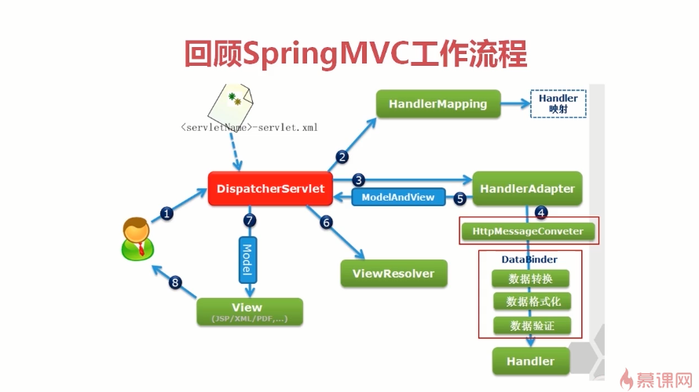
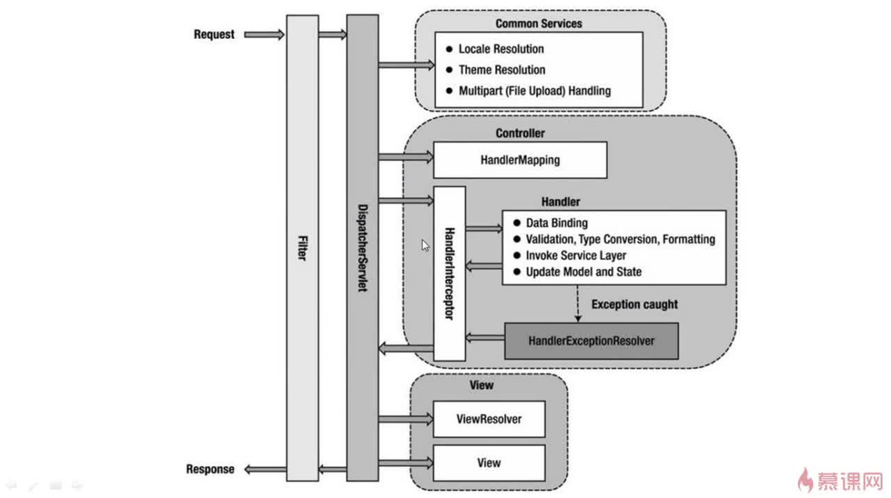
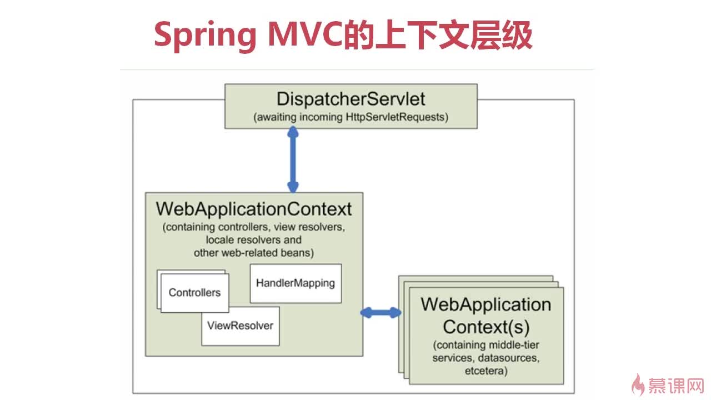
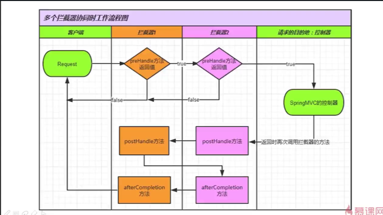
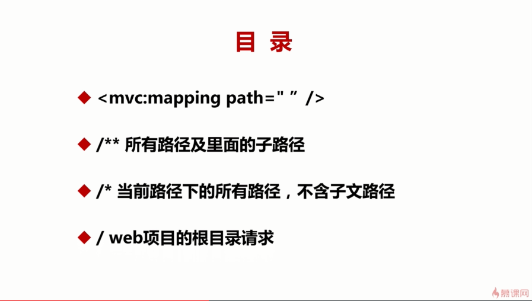
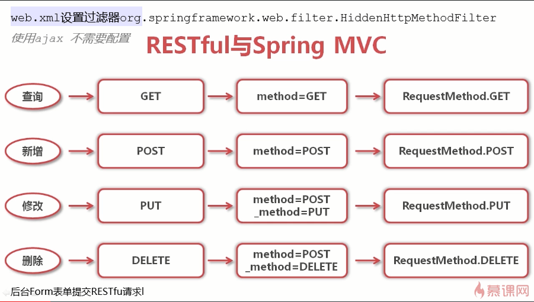
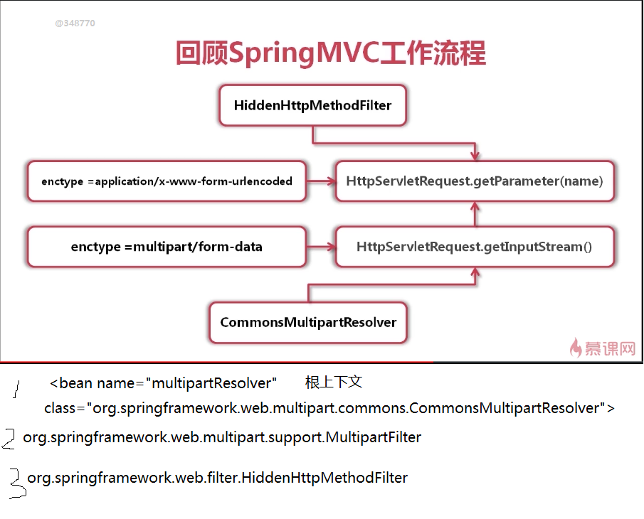

# SpringMVC

#### SpringMVC 工作流程



SpringMVC 动态概念:



SpringMVC 上下文:



#### SpringMVC 拦截器

拦截器链：



拦截器映射路径：



#### SpringMVC 处理 form 表单提交 restful 请求



SpringMVC 处理 form 表单提交带文件上传的 restful 请求:



`multipartResolver`:

> 放在 Spring 的根上下文

```
<bean name="multipartResolver" class="org.springframework.web.multipart.commons.CommonsMultipartResolver">
    <property name="maxUploadSize" value="209715200"></property>
    <property name="defaultEncoding" value="UTF-8"></property>
    <property name="resolveLazily" value="true"></property>
</bean>

```

`web.xml`:

```
<!--解决form表单提交restful请求带有文件上传 enctype="multipart/form-data"   -->
    <filter>
        <filter-name>MultipartFilter</filter-name>
        <filter-class>org.springframework.web.multipart.support.MultipartFilter</filter-class>
        <init-param>
            <param-name>multipartResolverBeanName</param-name>
            <param-value>multipartResolver</param-value>
        </init-param>
    </filter>
    <filter-mapping>
        <filter-name>MultipartFilter</filter-name>
        <url-pattern>/*</url-pattern>
    </filter-mapping>

    <!--springmvc配置用于form表单提交restful -->
    <!--使用ajax 不需要配置 -->
    <filter>
        <filter-name>HiddenHttpMethodFilter</filter-name>
        <filter-class>org.springframework.web.filter.HiddenHttpMethodFilter</filter-class>
    </filter>
    <filter-mapping>
        <filter-name>HiddenHttpMethodFilter</filter-name>
        <url-pattern>/*</url-pattern>
    </filter-mapping>

```
