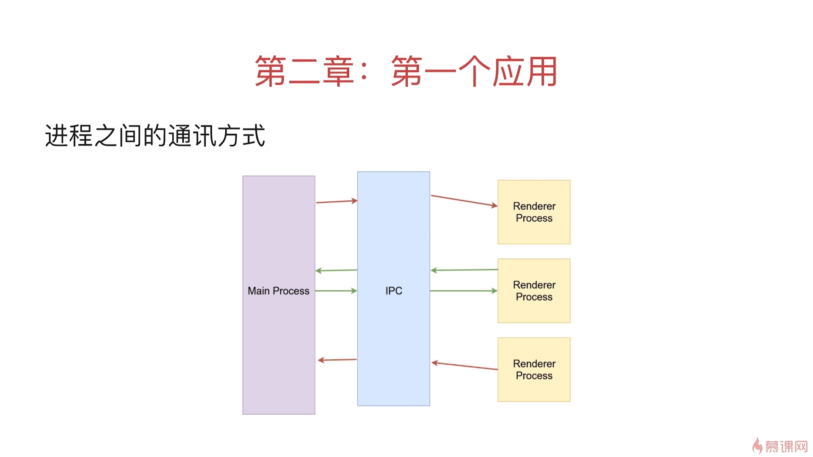

# Electron

> Electron 基于 Chromium 和 Node.js, 让你可以使用 JavaScript, HTML 和 CSS 构建跨平台的桌面应用

### 环境搭建

从开发的角度来看, Electron application 本质上是一个 Node. js 应用程序。 与 Node.js 模块相同，应用的入口是 package.json 文件。

```
npm init
```

npm 会帮助你创建一个基本的 package.json 文件。 其中的 main 字段所表示的脚本为应用的启动脚本，它将会在主进程中执行。 如下片段是一个 package.json 的示例：

```
{
  "name": "your-app",
  "version": "0.1.0",
  "main": "main.js",
  "scripts": {
    "start": "electron ."
  }
}
```

```
npm install --save-dev electron
```

### 主进程和渲染进程

主进程(Main Process)可以使用和系统对接的 ElectronAPI；创建渲染进程；全面支持 nodejs，只有一个。
渲染进程(renderer Process)可以有多个，每个对应一个窗口；每一个都是单独的进程；全面支持 nodejs 和 DOMAPI，可使用部分 Electron 提供的 API。

### 开发一个简易的 Electron

electron 模块所提供的功能都是通过命名空间暴露出来的。 比如说： `electron.app` 负责管理 Electron 应用程序的生命周期， `electron.BrowserWindow` 类负责创建窗口。

main.js:

```
const { app, BrowserWindow } = require('electron')

// 保持对window对象的全局引用，如果不这么做的话，当JavaScript对象被
// 垃圾回收的时候，window对象将会自动的关闭
let win

function createWindow () {
  // 创建浏览器窗口。
  win = new BrowserWindow({
    width: 800,
    height: 600,
    webPreferences: {
      nodeIntegration: true
    }
  })

  // 加载index.html文件
  win.loadFile('index.html')

  // 打开开发者工具
  win.webContents.openDevTools()

  // 当 window 被关闭，这个事件会被触发。
  win.on('closed', () => {
    // 取消引用 window 对象，如果你的应用支持多窗口的话，
    // 通常会把多个 window 对象存放在一个数组里面，
    // 与此同时，你应该删除相应的元素。
    win = null
  })
}

// Electron 会在初始化后并准备
// 创建浏览器窗口时，调用这个函数。
// 部分 API 在 ready 事件触发后才能使用。
app.on('ready', createWindow)

// 当全部窗口关闭时退出。
app.on('window-all-closed', () => {
  // 在 macOS 上，除非用户用 Cmd + Q 确定地退出，
  // 否则绝大部分应用及其菜单栏会保持激活。
  if (process.platform !== 'darwin') {
    app.quit()
  }
})

app.on('activate', () => {
  // 在macOS上，当单击dock图标并且没有其他窗口打开时，
  // 通常在应用程序中重新创建一个窗口。
  if (win === null) {
    createWindow()
  }
})

// 在这个文件中，你可以续写应用剩下主进程代码。
// 也可以拆分成几个文件，然后用 require 导入。
```

### 进程间通信



ipcMain

> 从主进程到渲染进程的异步通信。ipcMain 模块是 EventEmitter 类的一个实例。 当在主进程中使用时，它处理从渲染器进程（网页）发送出来的异步和同步信息。 从渲染器进程发送的消息将被发送到该模块

ipcRenderer

> ipcRenderer 是一个 EventEmitter 的实例。 你可以使用它提供的一些方法从渲染进程 (web 页面) 发送同步或异步的消息到主进程。 也可以接收主进程回复的消息。
