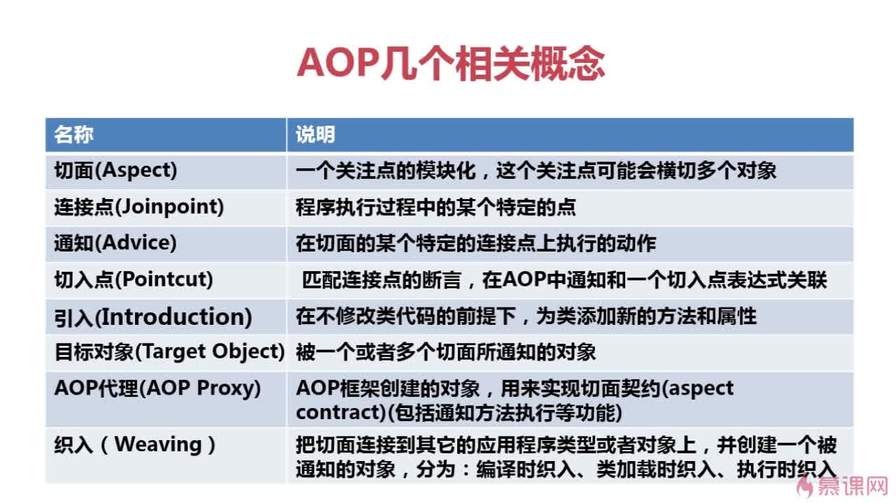
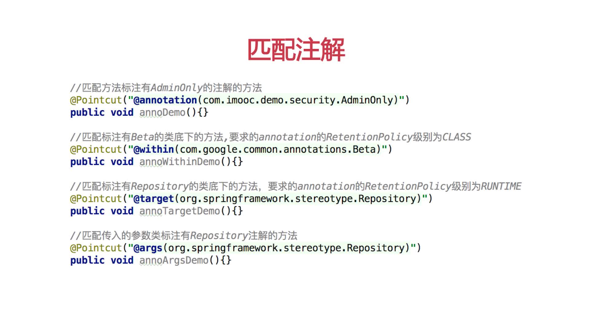
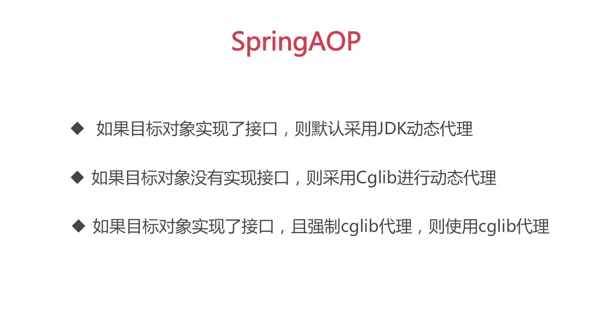
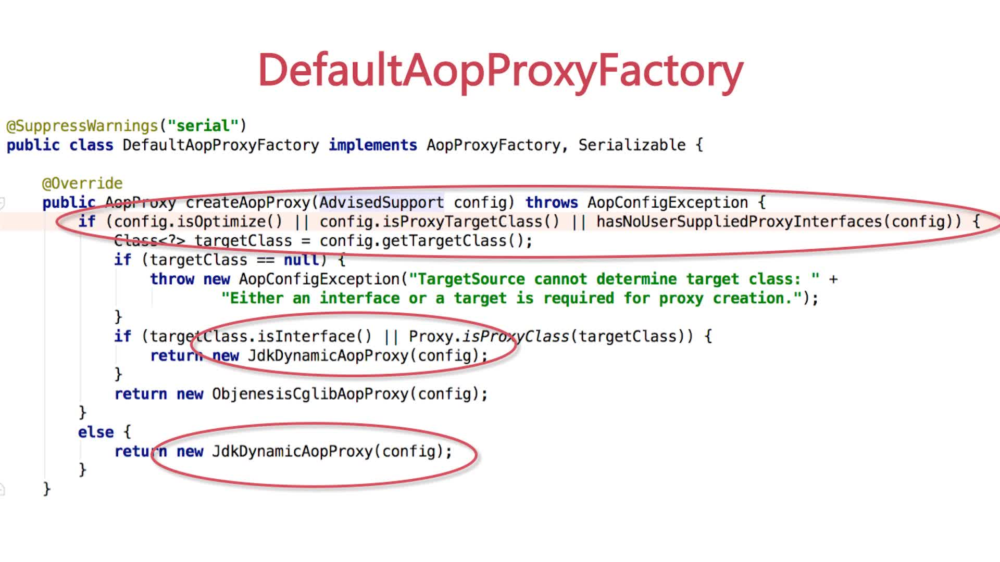
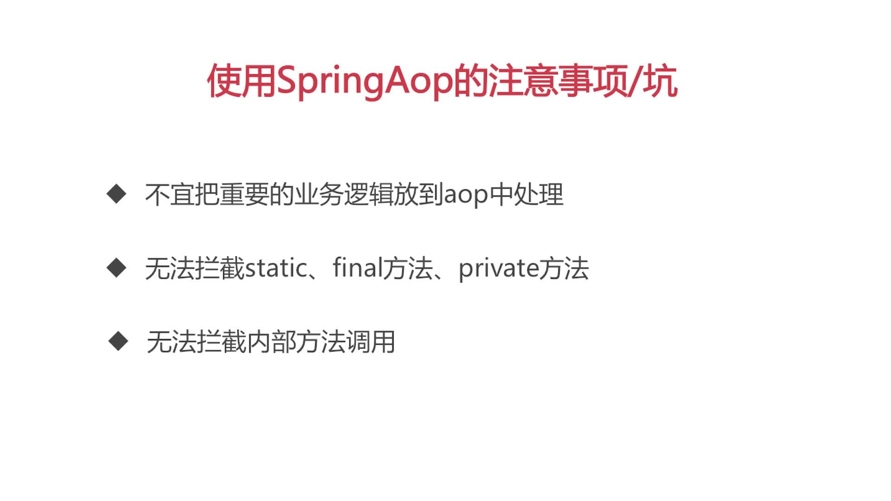

# SpringAOP

#### AOP 相关概念



#### Advice 类型


#### Advisor


#### Pointcut




#### AOP 代理选择





#### AOP 注意事项



#### AOP XML 方式

示例代码：

> 业务类

```
package aop;
public class Mooc {
	public void say() {
		System.out.println("hello....imooc....");
	}
	public void exc() throws Exception {
		System.out.println("throw...exception");
		throw new RuntimeException("抛出一个异常");
	}

	public int add(int a, int b){
		return a+b;
	}

	public int sub(int a, int b){
		return a-b;
	}

}

```

> 切面类

```
package aop;

import org.aspectj.lang.JoinPoint;
import org.aspectj.lang.ProceedingJoinPoint;
import org.aspectj.lang.Signature;

import java.util.Arrays;
import java.util.List;

//切面类
public class MoocAspect {

    public void before(JoinPoint joinPoint) {
        Signature signature = joinPoint.getSignature();
        String methodName =  signature.getDeclaringTypeName()+"_"+ signature.getName();
        List<Object> args = Arrays.asList(joinPoint.getArgs());
        System.out.println("MoocAspect....before method:"+methodName+ " args: " + args);
    }

    public void afterThrowing(JoinPoint joinPoint, Exception e) {
        Signature signature = joinPoint.getSignature();
        String methodName =  signature.getDeclaringTypeName()+"_"+ signature.getName();
        System.out.println("MoocAspect....after-throwing...method:"+methodName+" exception: "+e.getMessage());
    }

    public void after(JoinPoint joinPoint) {
        Signature signature = joinPoint.getSignature();
        String methodName =  signature.getDeclaringTypeName()+"_"+ signature.getName();
        System.out.println("MoocAspect....after the method:"+methodName);
    }


    public void afterReturning(JoinPoint joinPoint, Object returnValue) {
        Signature signature = joinPoint.getSignature();
        String methodName =  signature.getDeclaringTypeName()+"_"+ signature.getName();
        System.out.println("MoocAspect....afterReturning method:"+methodName+"  returnValue:"+returnValue);
    }


    public Object around(ProceedingJoinPoint pjp, int a, int b) {
        Object object = null;
        System.out.println("Aspect....around: " + "a: " + a + "  b: " + b);
        try {
            System.out.println("Aspect....around1");
            object = pjp.proceed();
            System.out.println("Aspect....around2");
        } catch (Throwable e) {
            e.printStackTrace();
        }
        return object;
    }

}
```

> xml

```
<?xml version="1.0" encoding="UTF-8"?>
<beans xmlns="http://www.springframework.org/schema/beans"
       xmlns:xsi="http://www.w3.org/2001/XMLSchema-instance"
       xmlns:aop="http://www.springframework.org/schema/aop"
       xsi:schemaLocation="http://www.springframework.org/schema/beans
        http://www.springframework.org/schema/beans/spring-beans.xsd
        http://www.springframework.org/schema/aop
        http://www.springframework.org/schema/aop/spring-aop-4.0.xsd">


    <!-- 切面类 -->
    <bean id="moocAspect" class="aop.MoocAspect"></bean>
    <!-- 业务类 -->
    <bean id="mooc" class="aop.Mooc"></bean>


    <aop:config>
        <aop:aspect id="moocAspectAOP" ref="moocAspect">
            <aop:pointcut expression="execution(* aop.Mooc.*(..))" id="moocPointcut"/>
            <aop:before method="before" pointcut-ref="moocPointcut"/>
            <aop:after-returning method="afterReturning" returning="returnValue" pointcut-ref="moocPointcut"/>
            <aop:after-throwing method="afterThrowing" throwing="e" pointcut-ref="moocPointcut"/>
            <aop:after method="after" pointcut-ref="moocPointcut"/>
            <aop:around method="around" pointcut="execution(* aop.Mooc.add(int, int)) and args(a,b)"/>
        </aop:aspect>
    </aop:config>

</beans>

```

#### AOP aspectj 方式

maven 依赖：

```
<dependency>
  <groupId>org.aspectj</groupId>
  <artifactId>aspectjrt</artifactId>
  <version>1.8.5</version>
</dependency>
<dependency>
  <groupId>org.aspectj</groupId>
  <artifactId>aspectjweaver</artifactId>
  <version>1.8.5</version>
</dependency>
```

xml 配置：

```
<?xml version="1.0" encoding="UTF-8"?>
<beans xmlns="http://www.springframework.org/schema/beans"
       xmlns:xsi="http://www.w3.org/2001/XMLSchema-instance"
       xmlns:context="http://www.springframework.org/schema/context"
       xmlns:aop="http://www.springframework.org/schema/aop"
       xsi:schemaLocation="http://www.springframework.org/schema/aop http://www.springframework.org/schema/aop/spring-aop-4.0.xsd
		http://www.springframework.org/schema/beans http://www.springframework.org/schema/beans/spring-beans.xsd
		http://www.springframework.org/schema/context http://www.springframework.org/schema/context/spring-context-4.0.xsd">


    <context:component-scan base-package="aspect"></context:component-scan>
    <aop:aspectj-autoproxy ></aop:aspectj-autoproxy>

</beans>
```

示例代码：

> 切面类

```
package aspect;

import org.aspectj.lang.JoinPoint;
import org.aspectj.lang.ProceedingJoinPoint;
import org.aspectj.lang.annotation.*;
import org.springframework.stereotype.Component;

import java.util.Arrays;
import java.util.List;


@Component
@Aspect
//排除自己
public class LogAspect {

    //Aspectj切入点表达式 根据方法签名匹配
    // 还有别的方式 扫描包，指定对象，含有注解(自定义注解)的类
    @Pointcut("execution(* aspect.Calculator.*(..))")
    public void log() {
    }

    @Before("log()")
    public void before(JoinPoint joinPoint) {
        String methodName = joinPoint.getSignature().getName();
        List<Object> args = Arrays.asList(joinPoint.getArgs());
        System.out.println("Before The method " + methodName + " begins " + args);
    }

    //后置通知
    @After("log()")
    public void afterMethod(JoinPoint joinPoint) {

        String methodName = joinPoint.getSignature().getName();
        List<Object> args = Arrays.asList(joinPoint.getArgs());
        System.out.println("After The method " + methodName + " ends " + args);

    }

    @AfterReturning(pointcut = "log()", returning = "returnValue")
    public void afterReturning(Object returnValue) {

        System.out.println("afterReturning: " + returnValue);

    }

    @AfterThrowing(pointcut = "log()", throwing = "e")
    public void afterThrowing(RuntimeException e) {
        System.out.println("AfterThrowing: " + e.getMessage());
    }

    @Around("execution(* aspect.Calculator.add(int,int)) && args(a,b)")
    public Object around(ProceedingJoinPoint proceedingJoinPoint, int a, int b) {
        Object object = null;
        System.out.println("Aspect....around: " + "a: " + a + "  b: " + b);
        try {
            //执行被代理的方法
            System.out.println("around1");
            object = proceedingJoinPoint.proceed();
            System.out.println("around2");
        } catch (Throwable e) {
            e.printStackTrace();
        }

        return object;
    }

}


```
